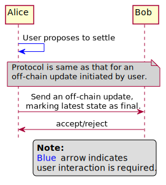
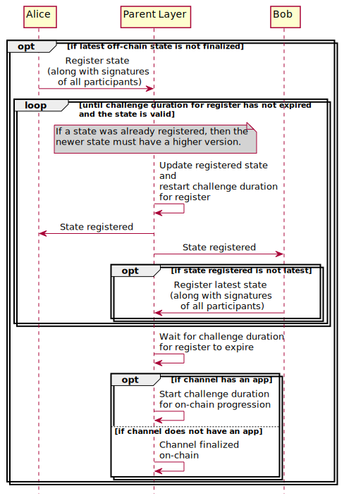
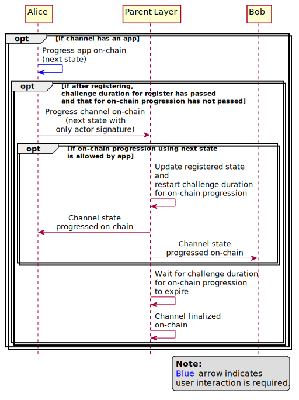
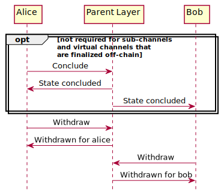

.. SPDX-FileCopyrightText: 2021 Hyperledger
   SPDX-License-Identifier: CC-BY-4.0

*********
Protocols
*********

Perun state channel protocols are a set of protocols for setting up a state
channels, doing off-chain transactions on these channels and settling them.

The life cycle of a state channel consists of 4 phases:

1. **Open phase**: Setup up the channel and deposit funds.
2. **Transact phase**: Do off-chain transactions.
3. **Register phase**: Agree on what state should be settled.
4. **Settle phase**: Settle the channel and withdraw funds.

Types of state channels
=======================

Perun protocols support three types of channels:

1. Ledger channel.
2. Sub-channel.
3. Virtual channel.

Life cycle for each of these channels consist of the same four phases described
above. The differences are in how the channels are funded during the ``open
phase`` and how the funds are withdrawn during the ``settle phase``. This
layer, where funds will be deposited / channels will be settled, will be
referred to as ``parent layer`` in the further discussions.

Ledger channel
--------------

   - Formed between any two parties having sufficient funds in their on-chain
     accounts.
   - The funds are directly deposited into the smart contracts on the
     blockchain.
   - Allows any number of off-chain transactions between the participants.
   - The channel must settled on the blockchain.

Sub-channel
-----------

   - Formed between participants who have a ledger channel established between
     them.
   - Funds are locked on the ledger channel. Hence, no on-chain interaction
     required to setup a sub-channel.
   - Sub-Channel is settled,

     - by unlocking the funds from the ledger channel, if both parties agree on
       the final state of the channel through off-chain transactions; or
     - by settling the parent channel on the blockchain, otherwise. In this
       case, the parent channel and all other sub-channels opened using the
       parent channel will also be settled on the blockhain.

Virtual channel
---------------

   - Formed between two participants who do not have a ledger channel
     established between them, but each of them has a ledger
     channel established with a common intermediary.
   - Funds are locked in the two ledger channels that the participants have
     with the intermediary. Hence, no on-chain interaction required.
   - Channel is settled,

     - by unlocking the funds from the two ledger channel, if both parties
       agree on the final state of the channel through off-chain transactions;
       or
     - by settling either one or both (depending on the scenario) parent
       channels on the blockchain, otherwise. In this case, the parent channels
       and all other sub-channels, virtual channels opened using the parent
       channel will also be settled on the blockhain.

.. note:

   From the above descriptions, it can be seen that sub-channels and virtual
   channels require **zero on-chain** interactions under normal circumstances.
   On-chain interactions are required only when the participants do not agree on
   the state to be settled.

In the next section, protocols for each of the four phases in
the life cycle of a state channel are described.


Phases of a state channel
=========================

Open phase
----------

In this phase, the channel is set up for off-chain transactions. Channel
opening consists of two phases:

1. Channel Proposal
2. Funding

The channel proposal protocol is same for all for three types of channels.
However, the ``parent layer`` used for funding and the funding protocol are
different:

1. for ledger channels it is the blockchain,
2. for sub-channels it is the ledger channel between the same participants, and
3. for virtual channels the ``parent layer`` consists of the two ledger
   channels between each of the channel participants and a common intermediary.

The funding protocols for each type of channel are described in the
:ref:`funding_and_withdrawal_protocols` section.

.. image:: ../_generated/concepts/open_generic.svg
  :align: Center
  :alt: Image not available


.. toctree::
   :hidden:

   protocols_funding_withdrawal

Transact phase
--------------

In this phase, any participant can initiate an off-chain transaction. The
participants can make as many off-chain transactions as they want.

The protocols for off-chain transactions is same for all three types of
channels. Even in case of virtual channels, no interaction is required with the
intermediary for doing off-chain transactions.

The protocol itself does not have any inherent speed limitations. Speed is
limited only by

1. the speeds at which the participants can make signatures, and
2. the speed of communication channels used for exchanging states & signatures.

If a participant knows an update to be proposed is the final off-chain
transaction, then it should be marked as ``final``. This is not a mandatory
part. If it is not done, then a separate off-chain transaction that marks the
latest off-chain state as final will be sent in the next phase.

.. image:: ../_generated/concepts/transact_generic.svg
  :align: Center
  :alt: Image not available

Register phase
--------------

In this phase, the state of the channel which should be settled will be agreed
upon. The balances locked in the parent layer will be redistributed to the
participants as per the balances in the settled state.

This phase consists of three sub-phases:

1. Finalize
2. Register dispute on-chain
3. Progress channel on-chain

1. Finalize
```````````

In this sub-phase, the protocol tries to create an agreement on the state to be
settled without any on-chain transactions. If it succeeds, then the channel
direclty progresses to the ``settle phase``. If not, then it transitions to the
next sub-phase. This protocol is same for all three types of channels.

If the latest off-chain state was marked as ``final`` already in the transact
phase, it implies both the participants have agreed it to be the state to be
settled. If it was not, another another off-chain transaction is sent, on behalf
of the participant who initiated the channel settlement, marking the latest
off-chain state as ``final``. It is up to the other participant to accept or
reject or ignore it.

If accepted, channel transitions to ``settle phase``, if not it transitions to
the next sub-phase.




2. Register dispute on-chain
````````````````````````````

In this sub-phase, the protocol creates an agreement on the state to be
settled by registering a dispute with the parent layer and resolving it.

The parent layer for registering dispute is always the blockchain. In case of

1. Ledger channel: The state of the channel, all its sub-channels and virtual
   channels must be collected and registered on the blockchain.

2. Sub-channel: The state of the parent channel, all the sub-channels and
   virtual channels of the parent channel must be collected and registered on
   the blockchain.

3. Virtual channel: The state of the parent channel between the participant who
   initiated channel settlement and the intermediary, all the sub-channels and
   virtual channels of this parent channel must be collected and registered on
   the blockchain.

   Once the common intermediary is notified that one of the parent channels
   holding funds for the virtual channel has been registered on-chain for
   dispute resolution, the intermediary will try to finalize the state of the
   virtual channel with the other channel participant (who did not initiate
   settlement) through an off-chain transaction. If is succeeds, then that the
   funds locked in the ledger channel between the intermediary and the other
   participant will be settled off-chain. If not, then this ledger channel,
   along with all its sub-channels and virtual channels will be registered on
   the blockchain for dispute resolution.




After the challenge duration for register expires, if the channel has

    1. ``No app``, then this state can be settled.
    2. ``An app``, the channel transitions to next sub-phase.

3. Progress the channel state on the blockhain
``````````````````````````````````````````````

This is a special sub-phase of register, relevant only for channels that have an
app.

In this sub-phase, the participants can unanimously update (using only their
signatures) the state of the channel after the challenge duration for register
has expired, but before the challenge duration for on-chain progression expires.
Each time the update is proposed on-chain, the app contract validates the
proposed update. If it is valid, the state is updated.

During each update, the challenge duration for on-chain progression is
restarted. The participants can make any number of on-chain progressions on the
blockchain, before the the challenge duration expires. Once it expires, the
channel transitions to ``settle phase``.



.. note::

    While the register phase is distinct in the protocol descriptions, it is up
    to the implementations to expose this phase to the user. For instance, in
    `go-perun` implementation of these protocols, APIs for ``on-chain
    progression`` and ``settle`` are exposed. Register is called implicitly by
    both of these APIs.

Settle phase
------------

In the settle phase, the funds in the channel are unlocked, redistributed
according to the balance in the settled state and moved back to the participants'
accounts in the parent layer.

Settling through off-chain transactions
```````````````````````````````````````

For sub-channels & virtual channels, for which the state to be settled has been
marked `final` through an off-chain transaction; the balances can be directly
withdrawn from the parent layer. In case of,

1. sub-channels: `parent layer` is the ledger channel between the participants.
2. virtual channels: `parent layer` is the two ledger channels, one between each
   of the participants and the common intermediary.


.. _settling_on_the_blockchain:

Settling on the blockhain
`````````````````````````

In case of ledger channels, they must always be settled on the blockchain. In
case of sub-channel or virtual channel, they must also be settled on the
blockchain under the following scenarios:

1. If the state to be settled was not finalized through off-chain transactions
   and the parent channel has been registered on the blockchain; or
2. If the parent channel has been registered on the blockchain because of a
   dispute in the parent channel itself or any of its other sub-channels or
   virtual channels.

Settling a channel (of any type) on the blockchain involves the following steps:

1. Trace back to the parent ledger channel, unlock the funds in it, redistribute
   it according to the balance in the settled state.

2. For each of the sub-channels and virtual channels in the ledger channel,
   
   1. Unlock the funds in it.
   2. Redistributed it according to the balance in its settled state.
   3. Accumulate the amounts in the redistributed balances against the
      participants' addresses in the parent ledger channel.

3. Finally, the accumulated amount is made available for each participant to be
   withdrawn.

Protocol for settling (for all the above cases) is shown below. The withdrawal
protocols for each type of channel are described in the
:ref:`funding_and_withdrawal_protocols` section.



