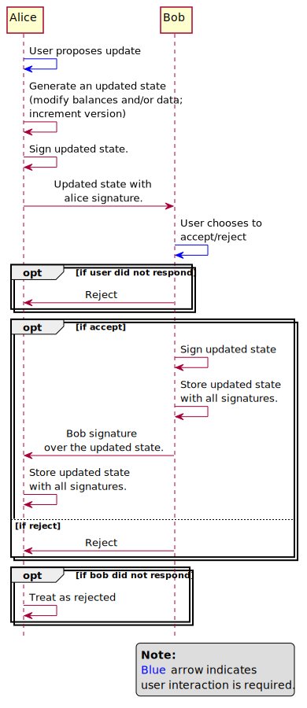

.. SPDX-FileCopyrightText: 2020 Hyperledger
   SPDX-License-Identifier: CC-BY-4.0

*********
Protocols
*********

Perun state channel protocols are a set of protocols for setting up a state
channel, doing off-chain transactions on these channels and settling them.

The life cycle of a state channel consists of 4 phases:

1. **Open phase**: Setup up the channel and deposit funds.
2. **Transact phase**: Do off-chain transactions.
3. **Register phase**: Agree on what state should be settled.
4. **Settle phase**: Settle the channel and withdraw funds.

Types of state channels
=======================

Perun protocols support three types of channels.

1. Ledger channel.
2. Sub-channel.
3. Virtual channel.

Life cycle for each of these channels consist of the same four phases described
above. The difference is where the funds are deposited during the open phase
and how they are settled. This layer, where funds will be deposited / channels
will be settled will be referred to ``parent layer`` in the further
discussions.

Ledger channel
--------------

   - Formed between any two parties having sufficient funds in their on-chain
     accounts.
   - The funds are directly deposited into the smart contracts on the blockchain.
   - Allows any number of off-chain transactions between the participants.
   - The channel must settled on the blockchain.

Sub channel
-----------

   - Formed between participants who have a ledger channel established between
     them.
   - Funds are locked on the ledger channel. Hence no on-chain interaction
     required to setup a channel.
   - Channel is settled,

     - By unlocking the funds from the ledger channel, if both parties agree on
       the final state of the channel through off-chain transactions.
     - By settling the parent channel on the blockchain, otherwise.

       In this case, the parent channel and all other sub-channels opened using
       the parent channel will also be settled.

Virtual channel
---------------

   - Formed between two participants who do not have a ledger channel
     established between them, but separately each of them have a ledger
     channel established with an intermediary.
   - Funds are locked in the two ledger channels that the participants have
     with the intermediary. Hence, no on-chain interaction required.
   - Channel is settled,

     - By unlocking the funds from the two ledger channel, if both parties
       agree on the final state of the channel through off-chain transactions.
     - By settling the either one or two (depending on the scenario)
       parent channel on the blockchain, otherwise.

       In this case, the parent channels and all other sub-channels, virtual
       channels opened using the parent channel will also be settled.

.. note:

   From the above descriptions, it can be seen that sub-channels and virtual
   channels require **zero on-chain** interactions under normal circumstances.
   On-chain interactions are required only when they do not agree on which
   state should be settled.

In the next section, protocols for corresponding to each of the four phases in
the life cycle of a state channel are described.


Phases of a state channel
=========================

Open phase
----------

In this phase, the channel is set up for off-chain transactions. Channel
opening consists of two phases:

1. Channel Proposal
2. Funding

The channel proposal protocol is same for all for three types of channels.
However, the ``parent layer`` used for funding and the funding protocol are
different.

The ``parent layer`` in case of

1. Ledger channel is blockchain.
2. Sub-channel is ledger channel between the same participants.
3. Virtual channel is two ledger channels: between each of the channel
   participants and a common intermediary.

The funding protocol for each of type of channel are described in detail in
the ``Funding protocols`` section.

.. image:: ../_generated/concepts/open_generic.svg
  :align: Center
  :alt: Image not available

Transact phase
--------------

In this phase, any participant can initiate an off-chain transaction. The
participants can make as many off-chain transactions as they want.

The protocols for off-chain transactions is same for all three types of
channels. Even in case of virtual channels, no interaction is required with the
intermediary for doing off-chain transactions.

The protocol itself does not have any inherent speed limitations. It is limited
only by the

1. Speeds at which the participants can make signatures
2. Speed of communication channels used for exchanging states & signatures.

If a participant knows an update to be proposed is the final off-chain
transaction, then it should be marked as ``final``. This is not a mandatory part.
If it is not done, then a separate off-chain transaction that marks the latest
off-chain state as final will be sent in the next phase.



Register phase
--------------

In this phase, the state of the channel which should be settled will be agreed
upon. The balances locked in the parent layer will be redistributed to the
participants as per the balances in the settled state.

This phase consists of three sub-phases:

1. Finalize
2. Register dispute on-chain
3. Progress channel on-chain

1. Finalize
```````````

In this sub-phase, the protocol tries to create an agreement on the state to be
settled without any on-chain transactions. If it succeeds, then the channel
direclty progresses to the settle phase. If not, then it transitions to the
next sub-phase. The protocol is same for all three types of channels.

If the latest off-chain state was marked as ``final`` already in the transact
phase, it implies both the participants have agreed it to be state that needs
to be settled. If it was not, another another off-chain transaction is sent, on
behalf of the participant who initiated the channel settlement, marking the
latest off-chain state as ``final``. It is up to the other participant to
accept or reject it.

If accepted, channel transitions to ``Settle phase``, if not it transitions to
the next sub-phase.

.. image:: ../_generated/concepts/register_generic_finalize.svg
  :align: Center
  :alt: Image not available


2. Register dispute on-chain
````````````````````````````

In this sub-phase, the protocol creates an agreement on the state  to be
settled by registering a dispute with the parent layer and resolving it.

The parent layer for registering dispute is always the blockchain. In case of

1. Ledger channel: The state of the channel, all its sub-channels and virtual
   channels must be collected and registered on the blockchain.

2. Sub-channel: The state of the parent channel, all the sub-channels and
   virtual channels of the parent channel must be collected and registered on
   the blockchain.

3. Virtual channel: The state of the parent channel between the participant who
   initiated channel settlement and the intermediary, all the sub-channels and
   virtual channels of this parent channel must be collected and registered on
   the blockchain.

   Once intermediary is notified that one of the parent channels holding funds
   for the virtual channel is registered on-chain, the intermediary will try to
   finalize the state of the sub-channel between the intermediary and the other
   channel participant (who did not initiate settlement) through an off-chain
   transaction. If is succeeds, then that sub-channel will be closed. If not,
   then the ledger channel backing that sub-channel, along with all its
   sub-channels will be registered on the blockchain.


.. image:: ../_generated/concepts/register_generic_register.svg
  :align: Center
  :alt: Image not available

After the challenge duration for register expires, if the channel has

    1. ``No app``, then this state can be settled.
    2. ``An app``, the channel transitions to force-execution sub-phase.

3. Progress the channel state on the blockhain
``````````````````````````````````````````````

This is a special sub-phase of register, relevant only for channels that have
an app.

In this sub-phase, the pariticipants can update unanimously (using only their
signatures) can update the state of the channel after the challenge duration
for register has expired, but before the challenge duration for on-chain
progression expires. Each time the update is proposed on-chain, app contract
validates it and it it is valid, the state is updated.

During each update, the challenge duration for on-chain progression is
restarted. The pariticipants can make any number of on-chain progressions on
the blockchain, before the the challenge duration expires. Once it expires, the
channel progresses to the settle phase.

.. image:: ../_generated/concepts/register_generic_progress.svg
  :align: Center
  :alt: Image not available

.. note::

    While the register phase is distinct in the protocol descriptions, it is up
    to the imlementations to expose this phase to the user. For instance, in
    `go-perun` implementation of these protocols, APIs for ``on-chain
    progression`` and ``settle`` are exposed. Register is called implicitly by
    both of these APIs.

Settle phase
------------

In the settle phase, the state of the channel is concluded on the parent layer
and the funds are withdrawn.

1. For finalized sub-channels & virtual channels
````````````````````````````````````````````````
If a channel is a sub-channel or ledger channel and the state to be settled was
finalized through off-chain transactions, then it could funds could be directly
withdrawn by making an update to the parent layer. In case of

1. Sub-channel: `parent layer` is the ledger channel between the particiants.
2. Virtual channel: `parent layer` is the two ledger channels, one between each
   of the pariticipants and the intermediary.

The withdrawal protocol for sub-channel and virtual channel each of type of
channel are described in detail in the ``Withdrawal protocols for sub-channels
and virtual channels`` section.

.. image:: ../_generated/concepts/settle_generic_finalized.svg
  :align: Center
  :alt: Image not available

2. For other cases
``````````````````

In case of ledger channels, they must always be settled on the blockchain. In
case of sub-channels or virtual channels, if the state to be settled was not
finalized off-chain and a dispute was registered on the blockchain, they must
be settled on the blockchain.

In all of these cases, `parent layer` is the blockchain.

.. image:: ../_generated/concepts/settle_generic_disputed.svg
  :align: Center
  :alt: Image not available


