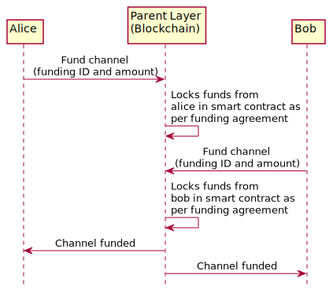
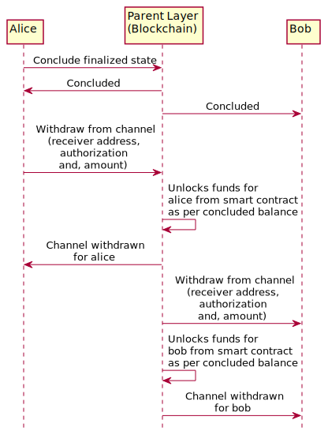
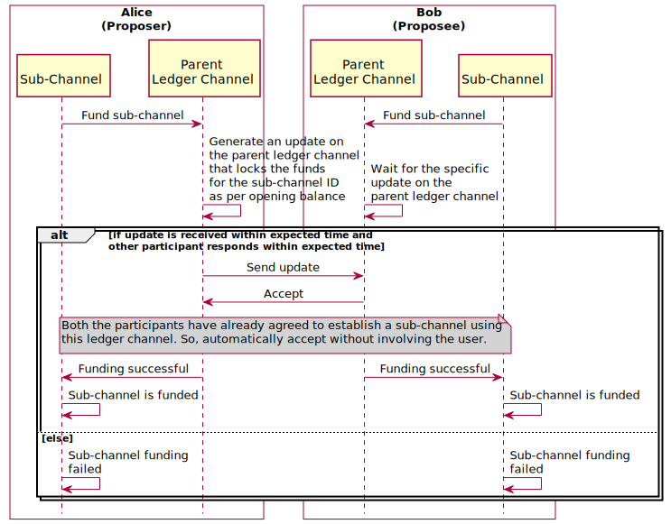
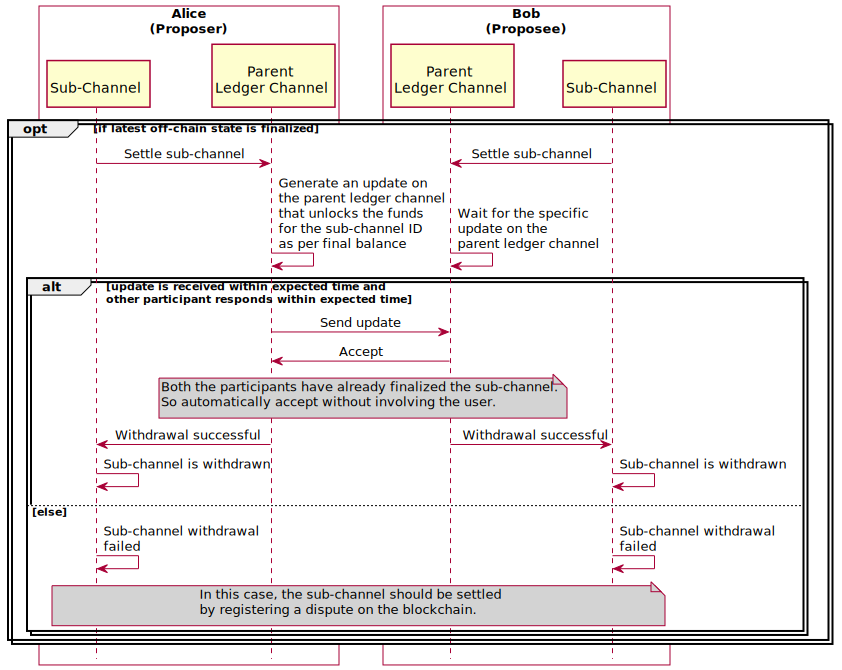
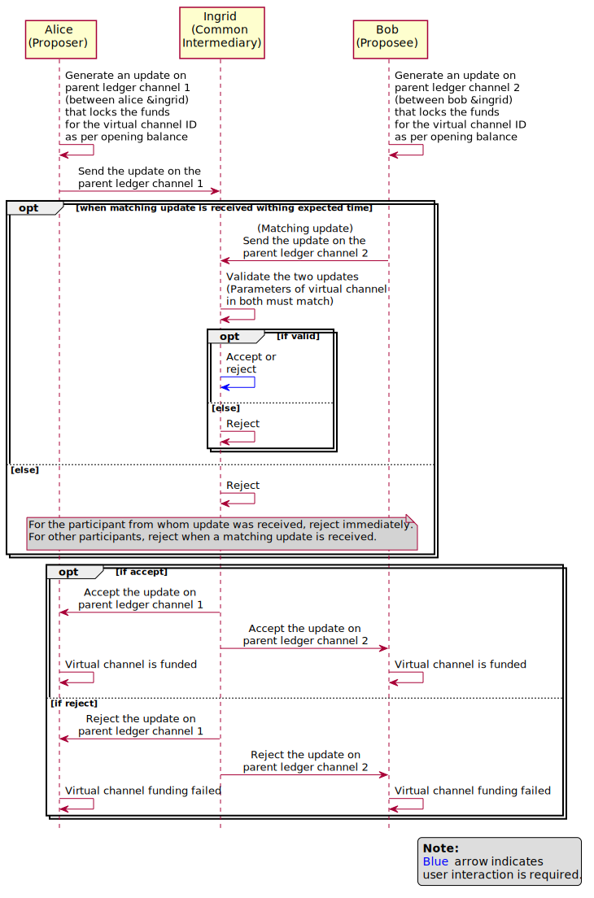
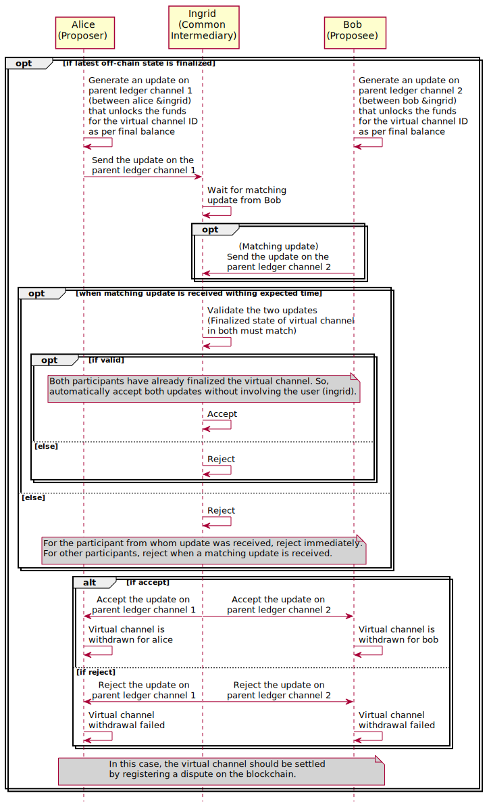

.. SPDX-FileCopyrightText: 2021 Hyperledger
   SPDX-License-Identifier: CC-BY-4.0

.. _funding_and_withdrawal_protocols:

******************************
Funding and settling protocols
******************************

Defintions of asset, funding and settling:

1. **Asset**: An asset can be any valid token on a given blockchain platform.
   For example, on Ethereum, it could be ETH, any ERC20 token or any other
   token. A channel can have one or more assets and channel balances will be
   defined for each asset.

2. **Funding**: Locking the agreed amount, for each asset, from each of the
   participant accounts on the parent layer against the channel ID.

   In case of a ledger channel, the agreed amount can be different from the
   initial balance of the channel. For instance, if Alice and Bob want to open
   a channel with balances 4 ETH and 6 ETH respectively, they could still agree
   to deposit 5 ETH each. The only condition here is that, for each asset, the
   sum of amounts in the opening balance must be equal to the sum of amounts in
   the funding agreement.

   In case of sub-channel and virtual channels, the funding agreement is the
   same as the opening balance.

3. **Settling**: Concluding a channel and withdrawing funds from it. See the
   section on :ref:`settle` phase for detailed explanation.

Ledger channel
==============

Funding protocol
----------------

A ledger channel is funded by depositing funds from on-chain accounts into the
smart contract using the funding ID as reference.

Any on-chain account can be used for depositing funds, as long as the funding
ID (a function of channel ID and the participant's address in the ledger
channel) is specified. The amounts can be sent in one or more transactions.

For instance, if Alice and Bob want to open a ledger channel with balances 4
ETH and 6 ETH respectively and have made a funding agreement same as opening
balance; then Alice can send 4 ETH in two transactions (of 2 ETH each) and Bob
can send 6 ETH in one transaction.

The channel will be considered funded when each of participants have deposited
at least the amounts corresponding to the agreed amount for each asset. If they
send more than their agreed amount, the extra funds will be locked in the
channel forever and can never be withdrawn, even after settling the channel.

.. note::
    
   ``Fund channel`` in the below diagram represents the participant depositing
   their agreed amounts. This in itself could be one or more transactions, from
   same or different on-chain accounts.

Settling protocol
-----------------

A ledger channel must be concluded before funds can be withdrawn. To conclude a
ledger channel, any one of the participants can conclude, using a state that
was finalized either through off-chain transaction or on the blockchain.  After
the channel is concluded, participants can withdraw the amount corresponding to
their address in the balance of the concluded state back to any on-chain
account. The on-chain account must be specified in the withdraw call and the
authorization must be signed using the keys corresponding to the participant's
off-chain address in the channel.

The participant could also withdraw their amount in multiple parts, to
different on-chain accounts, as long as the authorization is signed by the
participant in each call. On each call, the withdrawn amount will be
subtracted. Withdraw calls would succeed as long as the amount remaining is
greater than or equal to the amount in the withdraw call.

.. note::
    
   ``Withdraw from channel`` in the below diagram represents the participant
   withdrawing their entitled amounts. This in itself could be one or more
   transactions, withdrawing to same or different on-chain accounts.

Sub-channel
===========

Funding protocol
----------------

A sub-channel is funded by sending an off-chain transaction on the parent
ledger channel, that locks the funds corresponding to the opening balance of
the sub-channel. This update must be sent by the participant that proposed the
channel and the proposee must wait for it.

Settling protocol (when finalized off-chain)
--------------------------------------------

If a sub-channel was finalized through an off-chain transaction, then it can be
settled by sending a single update on the parent ledger channel. This update
will redistribute the locked funds as per the balance in the finalized state,
unlock them and move them back to pariticipants' accounts on the parent ledger
channel. This update must be sent by the participant that proposed the channel
and the proposee must wait for it and then accept it.

Settling protocol (when not finalized off-chain)
------------------------------------------------

If a sub-channel was not finalized through off-chain transaction or settling it
through off-chain update fails, then it must be finalized and settled on the
blockchain.  See :ref:`settling_on_the_blockchain` section in settle phase for
more details.

Virtual channel
===============

Funding protocol
----------------

A virtual channel is funded by sending two off-chain transactions. One
transaction on each of the the parent ledger channels between the common
intermediary and each of the participants.

Intermediary will be notified of this update. If they accept it, the channel
will be funded. If they reject, funding will fail.

Settling protocol (when finalized off-chain)
--------------------------------------------

If a virtual channel was finalized through an off-chain transaction, then it
can be settled by sending two updates: one on each of the parent ledger
channels. This update will redistribute the locked funds as per the balance in
the finalized state, unlock them and move them back to pariticipants' accounts
on each parent ledger channel. This update should be sent by each of the
channel pariticipants to the common intermediary. The common intermediary will
approve it only when both the updates match with each other.

Settling protocol (when not finalized off-chain)
------------------------------------------------

If a virtual channel was not finalized through off-chain transaction or
settling it through off-chain update fails, then it must be finalized and
settled on the blockchain.  See :ref:`settling_on_the_blockchain` section in
settle phase for more details.
