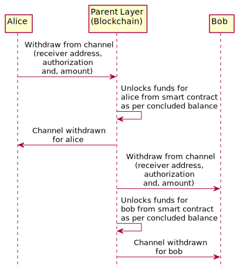
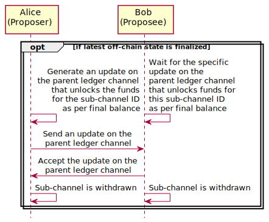
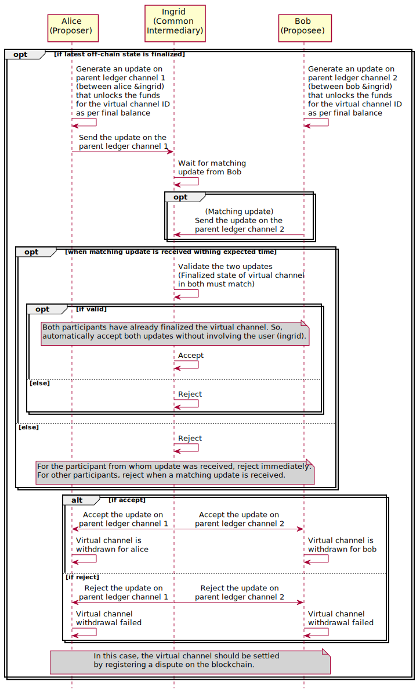

.. SPDX-FileCopyrightText: 2021 Hyperledger
   SPDX-License-Identifier: CC-BY-4.0

.. _funding_and_withdrawal_protocols:

********************************
Funding and withdrawal protocols
********************************

Defintions of asset, funding and withdrawal:

1. **Asset**: An asset can be any valid token on a given blockchain platform. For
   example, on ethereum platform, it could be ETH, any ERC20 token or any other
   token. A channel can have more one or more assets and channel balances will
   be defined for each asset.

2. **Funding**: Locking the agreed amount, for each asset, from each of the
   participant accounts on the parent layer against the channel ID.

   In case of ledger channel, the agreed amount can be different from the
   initial balance of the channel. For instance, if Alice and Bob want to open
   a channel with balances 4 ETH and 6 ETH respectively, they could still agree
   to deposit 5 ETH each. The only condition here is that, for each asset, the
   sum of amounts in the opening balance must be equal to the sum of amounts in
   the funding agreement.

   In case of sub-channel and virtual channels, the funding agreement is same
   as the opening balance.

3. **Withdrawal**: Redistribute the locked funds as per the balances in the
   concluded state of the channel, unlock them and make it available back in
   the participant accounts on the parent layer.

Ledger channel
==============

Funding protocol
----------------

A ledger channel is funded by depositing funds from on-chain accounts into the
smart contract using the funding ID as reference.

Any on-chain account can be used for depositing funds, as long as the funding
ID (a function of channel ID and the participant's address in the ledger
channel) is specified. The amounts can be sent in a one or more transactions.

For instance, if Alice and Bob want to open a ledger channel with balances 4
ETH and 6 ETH respectively and have made a funding agreement same as opening
balance; then Alice can send 4 ETH in two transactions (of 2 ETH each) and Bob
can send 6 ETH in one transaction.

The channel will be considered funded when each of participants have deposited
at least the amounts corresponding to the agreed amount for each asset. If they
send more than their agreed amount, the extra funds will be locked in the
channel forever and cannot be withdrawn even when/after settling the channel.

.. note::
    
   ``Fund channel`` in the below diagram represents the participant depositing
   their agreed amounts. This in itself could be one or more transactions, from
   same or different on-chain accounts.

.. image:: ../_generated/concepts/open_funding_ledger.svg
  :align: Center
  :alt: Image not available

Withdrawal protocol
-------------------

A ledger channel must be concluded before funds can be withdrawn. For each
asset, participants can withdraw the amount corresponding to their address in
the balance of the concluded state back to any on-chain account. The on-chain
account must be specified in the withdraw call and the authorization must be
signed using the keys corresponding to the participant's off-chain address in
the channel.

The participant could also withdraw their amount in multiple parts, to
different on-chain accounts, as long as the authorization is signed by the
participant in each call. On each call, the withdrawn amount will be
subtracted. Withdraw calls would succeed as long as the amount remaining is
greater than or equal to the amount in the withdraw call.

.. note::
    
   ``Withdraw from channel`` in the below diagram represents the participant
   withdrawing their entitled amounts. This in itself could be one or more
   transactions, withdrawing to same or different on-chain accounts.

Sub-channel
===========

Funding protocol
----------------

A sub-channel is funded by sending an off-chain transaction on the parent
ledger channel, that locks the funds corresponding to the opening balance of
the sub-channel.

Since both the participants agreed to establish a sub-channel using the ledger
channel at the time of channel proposal, this update is automatically accepted
without the requesting for approval from the user.

.. image:: ../_generated/concepts/open_funding_sub.svg
  :align: Center
  :alt: Image not available

Withdrawal protocol
-------------------

If a sub-channel was finalized through off-chain transactions, then funds can
be withdrawing as per the final balance by sending an update on the parent
ledger channel that unlocks the funds as per the final balance.

Since the update on the parent channel redistributes the funds according to the
final update on the sub-channel which was signed by both the participants; it
is automatically accepted without the requesting for approval from the user.

If a sub-channel was not finalized through off-chain transaction, then the
balances will have been withdrawn back in the parent ledger channel, when the
parent ledger channel was concluded on the blockchain. See
:ref:`settling_on_the_blockchain` section in settle phase for more details.

Virtual channel
===============

Funding protocol
----------------

A virtual channel is funded by sending two off-chain transactions. One
transaction on each of the the parent ledger channels between the common
intermediary and each of the participants.

Intermediary will be notified of this update. If they accept it, the channel
will be funded. If they reject, funding will fail.

.. image:: ../_generated/concepts/open_funding_virtual.svg
  :align: Center
  :alt: Image not available

Withdrawal protocol
-------------------

If a virtual channel was finalized through off-chain transactions, then funds
can be withdrawing as per the final balance by sending updates on the parent
ledger channels. Funds for Alice and will be withdrawn when update is sent and
accepted on the parent ledger channel between Alice and Ingrid. Similarly, it
will be withdrawn for Bob as well.

Since the update on the parent channel redistributes the funds according to the
final update on the virtual channel which was signed by both the participants;
it is automatically accepted without the requesting for approval from the user
(ingrid).

