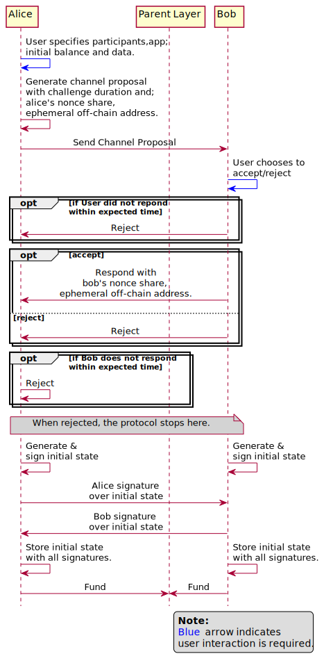
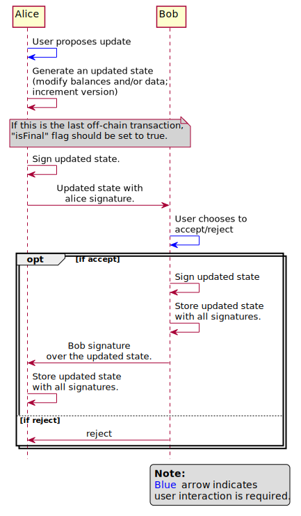
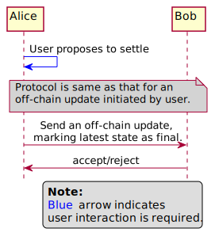
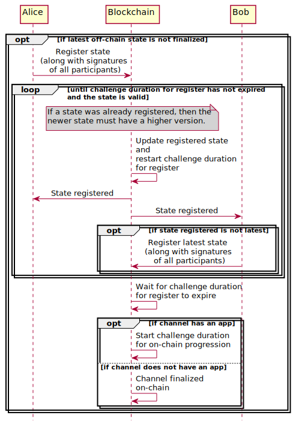
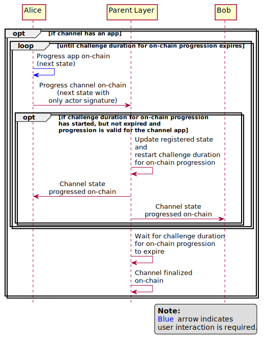
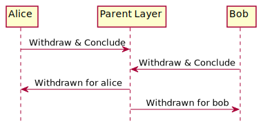
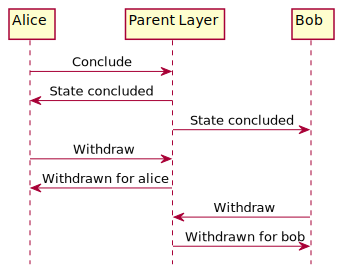

.. SPDX-FileCopyrightText: 2021 Hyperledger
   SPDX-License-Identifier: CC-BY-4.0

Phases of a state channel
=========================

Open phase
----------

In this phase, the channel is set up for off-chain transactions. Channel
opening consists of two phases:

1. Channel Proposal
2. Funding

The channel proposal protocol is the same for all channels types.  However, the
``parent layer`` used for funding and the funding protocol are different:

1. for ledger channels, it is the blockchain
2. for sub-channels, it is the ledger channel between the same participants
3. for virtual channels, it is a set of two ledger channels. Between each of
   channel participants with the intermediary.

The funding protocols for each type of channel are described in the
:ref:`funding_and_withdrawal_protocols` section.

Transact phase
--------------

In this phase, any participant can initiate an off-chain transaction. The
participants can make as many off-chain transactions as they want.

The protocol for off-chain transactions is the same for all channel types. In
case of virtual channels, no interaction is required with the intermediary for
doing off-chain transactions.

The protocol itself does not have any inherent speed limitations. Speed is
limited only by

1. the speeds at which the participants can make signatures, and
2. the speed of communication channels used for exchanging states & signatures.

Finalize phase
--------------

In this phase, an agreement on the final state of the channel will be
established among all the participants.

First, the participants try to finalize through an off-chain transaction. Only
when this fails, because of any participant rejecting or not responding to the
finalizing off-chain transaction; then the channel must be finalized on the
blockchain.

Finalizing on the blockchain involves more cost (cost of the on-chain
transactions) and takes more time (time to resolve disputes). On the other
hand, finalizing through off-chain transaction involves zero cost and is
instantaneous. Hence, in most scenarios, it will be in the best interest of the
participants to finalize through off-chain transaction.

1. Finalize through off-chain an transaction
^^^^^^^^^^^^^^^^^^^^^^^^^^^^^^^^^^^^^^^^^^^^

In this case, one of the participants sends an update on the channel, marking
the latest off-chain state as ``final``. In order for a channel to be marked
final, it must not have any locked funds. i.e there should be no open
sub-channel or virtual channel funded by it.

It is up to the other participant to accept, reject or ignore it.  If accepted,
the channel is finalized and transitions to :ref:`settle<settle>` phase. If
not, it must be finalized on the blockchain.

2. Finalize on the blockchain
^^^^^^^^^^^^^^^^^^^^^^^^^^^^^

To finalize the state of a channel on the blockchain, one of the participants
starts by registering a dispute on the blockchain. In case of

1. Ledger channel: The state of the channel, all its sub-channels and virtual
   channels must be collected and registered on the blockchain.

2. Sub-channel: The state of the parent channel, all the sub-channels and
   virtual channels of the parent channel must be collected and registered on
   the blockchain.

3. Virtual channel: The state of the parent channel between the participant who
   is registering dispute and the intermediary, all the sub-channels and
   virtual channels of this parent channel must be collected and registered on
   the blockchain.

   Once the common intermediary is notified that a dispute has been registered
   on the blockchain for one of the parent channels, the intermediary collects
   and stores the latest state of the virtual channel. Later, this state can be
   used by the intermediary for settling the other parent channel.

After a dispute is registered on the blockchain, all the other participants are
notified. They can refute with the latest state, if the registered state was
not the latest.

.. note::

    **To ensure that state finalized on the blockchain is the latest off-chain
    state**: When an older state is registered, one of the participants must
    refute with the latest state, in a timely manner. Otherwise, it is possible
    for an older state to be finalized on the blockchain.  Hence, it is
    mandatory each of the participants should be monitoring the blockchain
    continuously.

After the challenge duration for register expires, if the channel has

    1. ``No app``, the state is finalized and it progress to
       :ref:`settle<settle>` phase.
    2. ``An app``, then the channel enters the force-execution period.

Force execution period
""""""""""""""""""""""

This is relevant only for channels that have an app. Where, after the state of
the channel is finalized on the blockchain, any of the participants can
unanimously update (using only their signatures) the state of the channel, if
the app logic permits it.

They can do this after the challenge duration for dispute resolution had
expired and the challenge duration for force-update has not expired. Each time
a force-update is proposed, the proposed updated is applied after validating
with the app contract.

On each successful force-update, the challenge duration for force-update is
restarted. The participants can make any number of force updates on the
blockchain, until the challenge duration expires. Once it expires, the channel
transitions to :ref:`settle<settle>` phase.

.. _settle:

Settle phase
------------

Settling a channel consists of two steps:

1. **Conclude:** Redistribute the funds in the channel as per final balance and
   unlock them.
2. **Withdraw:** Move the funds back to the participants' accounts in the
   parent layer.

This section describes the settling protocol at a high level. A detailed
description of the protocol for each type of channel is given in the
:ref:`funding_and_withdrawal_protocols` section.

Settling through off-chain transactions
^^^^^^^^^^^^^^^^^^^^^^^^^^^^^^^^^^^^^^^

For sub-channels & virtual channels, that were finalized through an off-chain
update, they can be settled by directly on the parent layer. In case of,

1. Sub-channels: parent layer is the ledger channel between the participants.
2. Virtual channels: parent layer is the two ledger channels, one between each
   of the participants and the common intermediary.

In this case, all the participants will be withdrawing the funds to the same
parent ledger channel. Also, they will withdraw at the same time by sending a
single off-chain update on the parent ledger channel(s). Because of this, the
channel is concluded implicitly at the time of withdrawal.

.. _settling_on_the_blockchain:

Settling on the blockchain
^^^^^^^^^^^^^^^^^^^^^^^^^^

Channels must be settled on the blockchain under the following scenarios:

1. A ledger channels that was finalized through an off-chain transaction or on
   the blockchain.

2. Virtual channels or sub-channels that were

   - finalized on the blockchain because of a dispute in the channel.
   - finalized on the blockchain because of a dispute in the parent channel
     itself or any of the other sub-channels or virtual channels of the parent
     channel.
   - finalized through an off-chain transaction, but the off-chain transaction
     for settling has failed.

In this case, each of the participants can withdraw funds to their own accounts
in one or more transactions. Hence, the channel must be concluded explicitly
before withdrawing.

To conclude a channel on the blockchain,

1. Trace back to the parent ledger channel, unlock the funds in it, redistribute
   it according to the balance in the finalized state.

2. For each of the sub-channels and virtual channels in the ledger channel,

   1. Unlock the funds in it.
   2. Redistributed it according to the balance in the finalized state.
   3. Accumulate the amounts in the redistributed balances against the
      participants' addresses in the parent ledger channel.

3. Finally, the accumulated amount is made available for each participant to be
   withdraw.

.. note::
    While finalizing off-chain, finalizing on-chain, concluding, withdraw are
    shown as distinct steps, it is up to the implementations to provide
    separate APIs for each of these steps or provide an API which does two or
    more of these steps implicitly.
