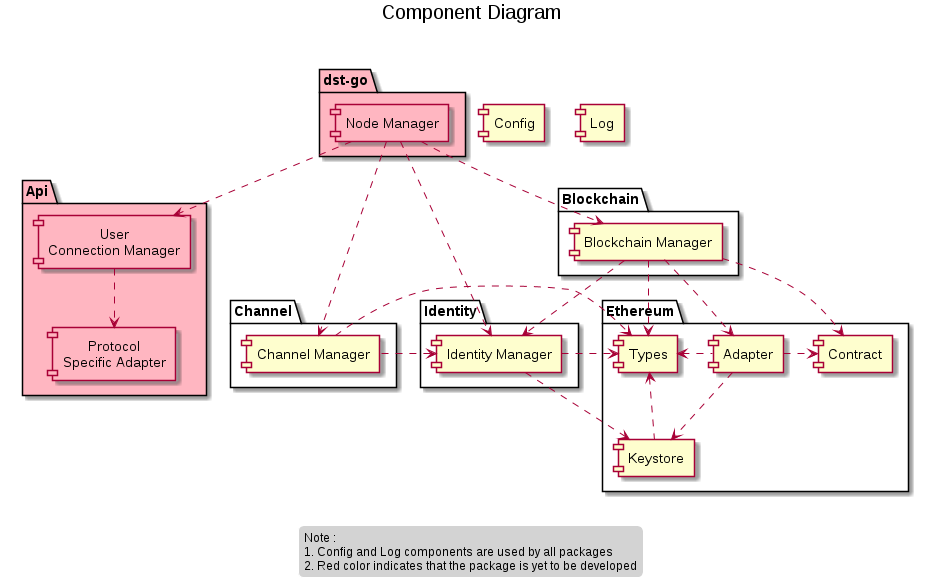
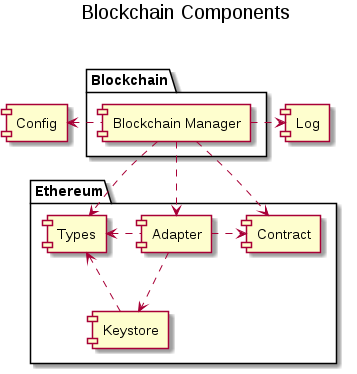
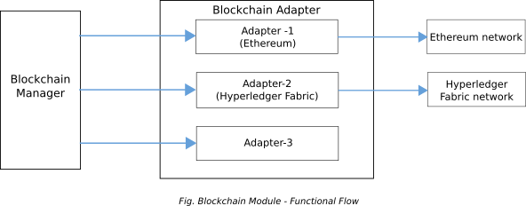
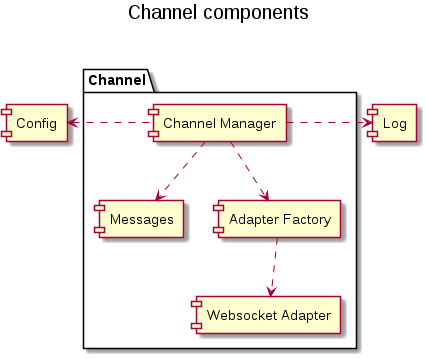
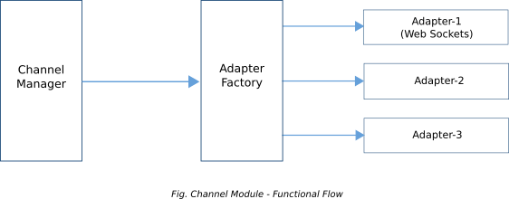
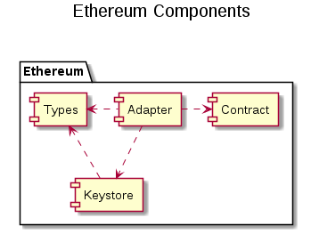
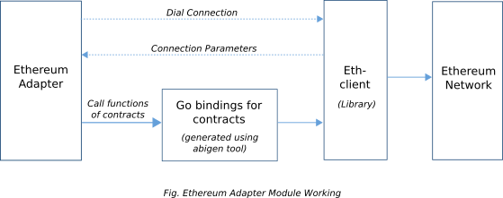

Developer Guide
================

Implementation Overview
-------------------------

dst-go software is intended to facilitate humans and machines to establish and transact on state channels using the Perun protocol. In order to achieve this, the software should be able to

* Communicate with different blockchain networks to deploy smart contracts and make transactions.
* Communicate with other DST nodes to make secure offchain transactions in accordance with Perun protocol.
* Manage the private keys of the user, support signing and verification of signatures.
* Provide an interface for the user to interact with the DST node.

Based on the above functionalities, different components in the software are organised into packages as shown in diagram below :


.. image:: ./_generated/developer_guide/package_diagram.png
  :align: Center
  :alt: Image not available


The central component of the software is the dst-go (node manager). This component will initialise state channels for offchain transactions and manage it throughout its lifecycle. It relies on the below modules for their respective functionalities :

* Blockchain module : Provides interfaces to interact with distributed ledger technology (DLT) networks. The interfaces are platform agnostic and use different adapters to communicate with each platform.
* Channel module : Provides interfaces to securely communicate with other dst nodes to send and receive offchain messages. The interfaces are communication protocol agnostic and use different adapters for each protocol.
* Identity module : Provides interfaces to store and manage onchain identities (keys) and offchain identities (URL) of different users.
* User API module : Provides interfaces to interact with the user. The interfaces are communication protocol agnostic and uses different adapters for each protocol.

* Log module : Provides wrappers over standard logging libraries that can be used in other modules.
* Config module : Provides configuration and version management functions that can be used in other modules.


An overview of components within each module and their dependencies is shown in the diagram and detailed description of each package is presented in following sections.




Note : The current version is yet to implement node manager, api modules. Hence it supports only a walkthrough of complete transaction cycle of establishing, transacting on and closing a ledger channel.
The walkthrough uses ethereum blockchain network and websocket adapter for offchain communication. Support for other platforms will come in future.
See :ref:`roadmap<roadmap>` for planned timeline for other features.

Blockchain Module
-------------------
The Blockchain module is one of the major components in the dst-go architecture, which is used to communicate with the DLT network.
It deploys the smart contracts, listens to & handles the events from the contracts. It also provides wrappers to call the various methods in the smart contracts.
In the current version, dst-go only supports Ethereum as its backend.

This module communicates with the Ethereum network using Web Sockets protocol since the node requires a persistent connection to watch for the events from contracts.

To run the tests, a simulated backend implementation is used.
In more detail, this is a mock of the geth node provided by the go-ethereum project, which performs transactions with no mining involved.
Hence, the response will be faster and used for development purposes.



Blockchain Manager
```````````````````
This is the main sub-module, which communicates with the node manager.
For each new transaction request, an instance of the connection will be created, which can be either simulated backend or the real blockchain network (test net or main net, depending on the target geth node).
This instance will hold all the blockchain related details of the transaction such as the connection, contract addresses, event channels and owner ID.

This module holds the wrapper to deploy the Perun smart contracts and the methods to call the functions defined in the smart contracts.
For this the abigen tool is used (available from go-ethereum project) which generates the go-bindings for the smart contracts written in solidity.
The generated go-binding files are available at contracts folder under ethereum module.



To communicate with the Ethereum network a library called ethclient is used.
It provides various methods and functions (For example, Dial, sendTransactions, getTransactionReceipt) to connect and perform transactions with the ethereum blockchain network.

To handle events from deployed smart contracts, go-channels are created for each of them and mapped to the instance created for the transaction.
These channels will be used by the subscribe function to listen for the events.

Blockchain Adapter
````````````````````
Blockchain adapter is a layer to accommodate different adapters such as adapter for Ethereum, Hyper ledger Fabric, and R3 etc. In this version, we have only the ethereum adapter implemented.
Since we need separation between the imports from the go-ethereum libraries and our implementation, it is available under ethereum module.

Blockchain Config
``````````````````
The config sub-module as usual holds some configurations related to the blockchain module such as the URL of the blockchain network to communicate in case a real backend is used. By default, the URL will be configured at ws://localhost:8546 (at config.go file mentioned as gethURL) to communicate with the local geth node using Web Sockets.
In addition, the config_for_test file holds the configurations for testing such as the key store, logger level etc.

Channel Module
---------------
The channel module handles all the communication aspects of the DST node with another one. When initializing a new transaction, the channel module will receive a request from the node manager to create a channel with the other DST node to transact the states off-chain.
It holds the various adapters for the channel communication such as Web Sockets adapter, which uses the Web Sockets protocol to connect with  another node. The channel module also performs the handling of new requests from other nodes and parsing of the messages communicated.
A dedicated set of messages for each type of request and response is structured and implemented.

Below are the major components of the channel module,



Channel Manager
````````````````
The channel manager is the first layer of the channel module to which the node manager talks with. This sub-module has definite set of API’s which facilitates to create a new user session, signing of the new MS Contract and VPC Contract states.
While creating a new user session, the user can provide the adapter type as parameter. Creating a new user session involves actions such as starting the listener to listen the incoming connection requests from other node and it will also create a new channel for self to run the tests.
This self-channel will destroy once the tests are completed. The off-chain primitives component is also part of the channel manager module.

Each channel consists of a channel session ID, which is globally unique to the particular channel. The channel session id is derived from a combination of sender address, receiver address and a random number.
For specifics of how it is derived please refer the source code of channel module.

In addition to this, the channel manager is also responsible adding signatures to the new VPC and MSC states.
The signature is added and verified using the dedicated functions available in Identity module.
After verification, the new states will be updated in the respective channel.

Adapter Factory
```````````````
This module provides an interface to the various adapters with definite set of functions, so that the implementation on channel manager remains the same for all adapter types.
The interface contains functions such as new channel, start listener, read, write and close.

The channel manager will call these functions along with passing the adapter type in the arguments.
Based on this parameter, it will call the respective adapter functions in the adapter-submodule.

The channel details such as the channel address, session ID, connection status, channel status (init, open, in conflict, settled, close), VPC states, MSC states etc., are maintained in an object having a defined structure, which will be used for the entire transaction.



Channel Adapter
````````````````
The channel adapter holds the communication protocol using which the node can communicate with the other node.
There can be different types of channel adapters. Each of them represents different communication protocols. Currently the Web Sockets adapter has been developed and included.
In future, if different protocol implementations can be included like CoAP, MQTT etc.

These adapters must satisfy the interface provided by the adapter factory to the channel manager such as new channel, start listener, read, write and close.

Messages
`````````
This is a sub-module, which handles all the messages communicated with the other node.
It includes functionality to parse the messages according to the message types and to respond to the requests made by the other nodes.
There are multiple functions included to provide the required message format to the channel manager, which are packed into an interface named MsgStub and added to the readWriteClosure interface in the adapter factory.

The message formats for all types of requests and response are clearly defined in the JSON format and so they are independent of the adapter type used.
The MsgStub interface consists of functions, which satisfies the request, read, and response calls for different message types such as Identity, new channel, session ID, contract address, new MSC base state and new VPC state.

All the messages sent to the other node will have a uniform JSON structure with the following elements:

* Version: holds the version of the node
* Message ID: Represents the message type (For example, In case of identity request, the message ID will be *MsgIdentityRequest*)
* Message: The Message element will accommodate the different JSON message structures, which are defined for all message types used.

.. code-block:: json

    {
        "version": "0.1",
        "message_id": "MsgIdentityRequest",
        "message": {
        "id": {
                "on_chain_id": "0x815430d6ea7275317d09199a5a5675f017e011ef",
                "listener_ip_addr": "192.168.1.1:9601",
                "listener_endpoint": "/",
            }
        },
        "timestamp": "2019-06-19T16:26:01.848944105+05:30"
    }

The different message types used and their structures are explained below.

**1. MsgIdentity:** For requesting and sharing the identity with the other node.
The *ID* element will be of type *OffChainID* from identity module which holds the onchain id, listener address and the listener end point.
Listener address and listener endpoint together represent the offchain identity of the user.

.. code-block:: json

    {
        "version": "0.1",
        "message_id": "MsgIdentityRequest",
        "message": {
        "id": {
                "on_chain_id": "0x815430d6ea7275317d09199a5a5675f017e011ef",
                "listener_ip_addr": "192.168.1.1:9601",
                "listener_endpoint": "/",
            }
        },
        "timestamp": "2019-06-19T16:26:01.848944105+05:30"
    }

    {
        "version": "0.1",
        "message_id": "MsgIdentityResponse",
        "message": {
            "id": {
                "on_chain_id": "0x815430d6ea7275317d09199a5a5675f017e011ef",
                "listener_ip_addr": "192.168.1.2:9602",
                "listener_endpoint": "/",
            }
        },
        "timestamp": "2019-06-19T16:26:01.950726729+05:30"
    }

**2. MsgNewChannel:** This message type is used for requesting a new channel and to respond to the channel requests.
The *Status* field will be set as require in case of requesting and accept/decline while responding to the request.
The *contractStoreVersion* and *MsgProtocolVersion* is to verify with the other node while requesting since they need to be same to establish a channel.
*Reason* is an additional field to respond, in case of rejecting the channel request.

.. code-block:: json

    {
        "version": "0.1",
        "message_id": "MsgNewChannelRequest",
        "message": {
            "contract_store_version": "i531HXpzQ6khM/JKqhulRNkurBzNZscxqiQ+MnPLD2k=",
            "msg_protocol_version": "0.1",
            "status": "require",
            "reason": ""
        },
        "timestamp": "2019-06-19T16:26:02.056635446+05:30"
    }

    {
        "version": "0.1",
        "message_id": "MsgNewChannelResponse",
        "message": {
            "contract_store_version": "i531HXpzQ6khM/JKqhulRNkurBzNZscxqiQ+MnPLD2k=",
            "msg_protocol_version": "0.1",
            "status": "accept",
            "reason": ""
        },
        "timestamp": "2019-06-19T16:26:02.156725295+05:30"
    }


**3. MsgSessionID:** For requesting and sharing the session ID created for each channel.
The session ID creation workflow is explained under channel manager component.
Similarly the *Status* field will be set to require, accept or decline as required to provide the response to other node.

.. code-block:: json

    {
        "version": "0.1",
        "message_id": "MsgSessionIdRequest",
        "message": {
            "sid": {
                "sid_complete": null,
                "sid_sender_part": "za3qi8nqVuUl5OHnFPZbj7U/xXL5h9xbJSL0V6YdoPg=",
                "sid_receiver_part": null,
                "addr_sender": "0x932a74da117eb9288ea759487360cd700e7777e1",
                "addr_receiver": "0x815430d6ea7275317d09199a5a5675f017e011ef",
                "nonce_sender": "WopJugZ+L60F1npAt1DPI5+2wrND51Kq8RtghckPY/E=",
                "nonce_receiver": null,
                "locked": false
            },
            "status": "require"
        },
        "timestamp": "2019-06-19T16:26:02.157558545+05:30"
    }

    {
        "version": "0.1",
        "message_id": "MsgSessionIdResponse",
        "message": {
            "sid": {
                "sid_complete": 1.03077757917736517375684670265721440303432031097546088006405874685720632567695e+77,
                "sid_sender_part": "za3qi8nqVuUl5OHnFPZbj7U/xXL5h9xbJSL0V6YdoPg=",
                "sid_receiver_part": "5zhfiObUqytBOOp586/fVtn61DOL8Mt4D69uWnDLonM=",
                "addr_sender": "0x932a74da117eb9288ea759487360cd700e7777e1",
                "addr_receiver": "0x815430d6ea7275317d09199a5a5675f017e011ef",
                "nonce_sender": "WopJugZ+L60F1npAt1DPI5+2wrND51Kq8RtghckPY/E=",
                "nonce_receiver": "spB2W7bEYssxZVfm1n60W1czFYcGUUraPwIuF1Z+P6o=",
                "locked": true
            },
            "status": "accept"
        },
        "timestamp": "2019-06-19T16:26:02.255316475+05:30"
    }

**4. MsgContractAddr:** For requesting and sharing the smart contract addresses based on which the transaction is going to be performed.
The *Addr* field will have the contract address, *ContractType* will have the contract type such as libSignatures, MSContract or VPC.
The *Status* field will be set to require, accept or decline as required to provide the response to other node.

.. code-block:: json

    {
        "version": "0.1",
        "message_id": "MsgContractAddrRequest",
        "message": {
            "addr": "0x21c7c9b5ac63d9930d6410ed29499cbd6afcee4d",
            "contract_type": {
                "Name": "LibSignatures",
                "Version": "0.0.1",
                "HashSolFile": "359e2e9f7bacdcefc6962c46182aba7f16b8b0a8314468ca8dd88edd25299209",
                "HashBinRuntimeFile": "3c0f29dfe76fd55ab0b023b26c97d2a306805a03788277cd0c7d2817cb7a9bf9"
            },
            "status": "require"
        },
        "timestamp": "2019-06-19T16:26:03.076359191+05:30"
    }

    {
        "version": "0.1",
        "message_id": "MsgContractAddrResponse",
        "message": {
            "addr": "0x21c7c9b5ac63d9930d6410ed29499cbd6afcee4d",
            "contract_type": {
                "Name": "LibSignatures",
                "Version": "0.0.1",
                "HashSolFile": "359e2e9f7bacdcefc6962c46182aba7f16b8b0a8314468ca8dd88edd25299209",
                "HashBinRuntimeFile": "3c0f29dfe76fd55ab0b023b26c97d2a306805a03788277cd0c7d2817cb7a9bf9"
            },
            "status": "accept"
        },
        "timestamp": "2019-06-19T16:26:03.07712425+05:30"
    }

**5. MsgMSCBaseState:** For requesting and sharing the signed base state of MS Contract.
The *SignedStateVal* consists of the base state along with the fields to hold the signature of sender and receiver.
The *Status* field will be set to require, accept or decline as required to provide the response to other node.

.. code-block:: json

    {
        "version": "0.1",
        "message_id": "MsgMSCBaseStateRequest",
        "message": {
            "signed_state_val": {
                "ms_contract_state": {
                    "vpc_address": "0x847b3655b5beb829cb3cd41c00a27648de737c39",
                    "sid": 1.03077757917736517375684670265721440303432031097546088006405874685720632567695e+77,
                    "blocked_sender": 10000000000000000000,
                    "blocked_receiver": 10000000000000000000,
                    "version": 1
                },
                "sign_sender": "gedbHY+liu3JHoaA6QiOiDQUnyq83/ycuhNbbaf8Vfp2D0IhAHwEs1DZOjg9D0y7ZzELErrYA3JiWAjbucfvyBs=",
                "sign_receiver": null
            },
            "status": "require"
        },
        "timestamp": "2019-06-19T16:26:06.330096326+05:30"
    }

    {
        "version": "0.1",
        "message_id": "MsgMSCBaseStateResponse",
        "message": {
            "signed_state_val": {
                "ms_contract_state": {
                    "vpc_address": "0x847b3655b5beb829cb3cd41c00a27648de737c39",
                    "sid": 1.03077757917736517375684670265721440303432031097546088006405874685720632567695e+77,
                    "blocked_sender": 10000000000000000000,
                    "blocked_receiver": 10000000000000000000,
                    "version": 1
                },
                "sign_sender": "gedbHY+liu3JHoaA6QiOiDQUnyq83/ycuhNbbaf8Vfp2D0IhAHwEs1DZOjg9D0y7ZzELErrYA3JiWAjbucfvyBs=",
                "sign_receiver": "tXSZTwMNGBtYzmN5av15jNek1KznWmCnLbZtDoI5qWFIW6n8KyCzzW7TPjQ5UfyYueTalWpFJQlAfJbtnIRGehs="
            },
            "status": "accept"
        },
        "timestamp": "2019-06-19T16:26:08.10574952+05:30"
    }


**6. MsgVPCState:** For requesting and sharing the signed VPC state.
Similar to *MsgMSCBaseState*, this also has a *SignedStateVal* element which contains the VPC State along with the fields to hold the signature of sender and receiver.
The *Status* field will be set to require, accept or decline as required to provide the response to other node.

.. code-block:: json

    {
        "version": "0.1",
        "message_id": "MsgVPCStateRequest",
        "message": {
            "signed_state_val": {
                "vpc_state": {
                    "id": "pGtLhBmVQVfnLu9alWbrIzSUMF0WrSbE62TN/ormCG0=",
                    "version": 1,
                    "blocked_alice": 9000000000000000000,
                    "blocked_bob": 11000000000000000000
                },
                "sign_sender": "q3gQz87vpWa8W9f4AgAGSWPFEX0vHR4/JAKdHbctdIUDWwXwL/bDaweuCflyBFRepcnQCK3l66CyrBE9wVPAnhs=",
                "sign_receiver": null
            },
            "status": "require"
        },
        "timestamp": "2019-06-19T16:26:10.310832269+05:30"
    }

    {
        "version": "0.1",
        "message_id": "MsgVPCStateResponse",
        "message": {
            "signed_state_val": {
                "vpc_state": {
                    "id": "pGtLhBmVQVfnLu9alWbrIzSUMF0WrSbE62TN/ormCG0=",
                    "version": 1,
                    "blocked_alice": 9000000000000000000,
                    "blocked_bob": 11000000000000000000
                },
                "sign_sender": "q3gQz87vpWa8W9f4AgAGSWPFEX0vHR4/JAKdHbctdIUDWwXwL/bDaweuCflyBFRepcnQCK3l66CyrBE9wVPAnhs=",
                "sign_receiver": "G2eTt3NvD62IPhYMEb4nR1PH0Xbxy4gYqUelt9Eb7A89yylX44jWQkihbXfZT8UQA60lAngA1klTDmt6lvzvTRs="
            },
            "status": "accept"
        },
        "timestamp": "2019-06-19T16:26:11.090209805+05:30"
    }


Channel Config
```````````````
The config sub module holds some basic configurations for the channel module such as max connections, logger level and provision to implement some flags when needed.
The config_for_test file also holds the configurations used such as IP, Port number, Alice and Bob addresses loaded from the testdata module for performing tests.

Config Module
--------------
This module holds the functions to parse the flags given by the user and set the corresponding values to the desired config variables.
Currently it is used only to very limited level, since there is no RPC implemented yet.

Ethereum Module
----------------
This module holds all the things related to Ethereum.
It is created to accommodate all the libraries used from the go-ethereum project, mainly to create a separation between code and the imported libraries.
This module provides a wrapper to the types used from the go-ethereum/types library by type casting them. It holds the Perun smart contracts and their respective go-bindings along with their binary-runtime file to cross check the contract’s integrity.
It houses the test-keystore, which is used for the tests.
The main components of the ethereum module are shown in the below diagram.



Adapter
````````
The Adapter sub-module is mainly created to provide an interface to some of the functions, which requires libraries from the go-ethereum project such as the ethclient library to provide general APIs (such as Dial to connect) to work with the ethereum network.
Currently the ethclient library is used only to connect, since all the function calls and transaction are done using the go-bindings generated for the contracts.
The connection is required by the adapter to call the contract functions using the go-bindings generated.
The go-bindings also uses ethclient functions (imported as a library into the binding files during generation itself) and uses them to communicate with the network.
It is as if they are providing a wrapper to the ethclient module with some methods specific to the Perun smart contracts.



It also imports various other modules from the go-ethereum project such as to create a simulated backend, types to create transactions opts etc.
It has the functions to deploy contract on both the real backend and simulated backend since their types are different, to make the objects required for transactions (transact), listen to events (filterer) and call smart contract functions (caller).

Contract
`````````
The Contract sub-module has the Perun smart contract written in solidity and go-bindings for the contracts.
This go-bindings generation is done using the Abigen tool.
It also compiles and creates the bin-runtime file of the contracts using the Solc (solidity compiler) tool.
After this step the solidity file, the go-binding file and the bin-runtime file for all the contracts exists.
Whenever a contract is deployed, the code will be fetched from the ethereum network using its contract address and compared with the hash of the bin-runtime file created using Solc, which is available at contract store.
This is to check the integrity of the deployed contract before doing any transaction over it.

Types
``````
The Types sub-module provides an interface to the data types, which are commonly imported from the go-ethereum project.
It acts as  a wrapper to the imported types, which will be imported and used in the integration to avoid using the go-ethereum imports directly into the provided code.

Keystore
`````````
The Keystore provides wrappers to the functions, which uses go-ethereum methods related to key handling.
It also has a test key store with two default key files used for performing variety of unit tests and integration tests.
It also has a sample keystore in JSON file format, which holds some ID’s (ethereum Addresses), which has addresses and their passwords along with the temporary DST addresses (IP address) to perform tests.

dst-go Module (node manager)
----------------------------
This module is the main module, which initializes all the other modules and communicates with them.
This module will create a binary, which runs the node.
All the other modules are imported into this main module.

This module receives all the user inputs, parse them and do necessary actions. During initialization, it will initialize the logger for all the modules.
Currently we cannot perform anything using this dst-go module since the RPC development is in progress.

Identity Module
---------------
This module loads the key store during initialization of the node and provides various functions for signing the messages for transactions.
There are two major components in the identity module,the identity manager and signing component.

Identity Manager
`````````````````
This sub module provides various methods and functions for handling the keys. The main functionality of the identity manager is to create a new user session along with an ID store.
It has dedicated functions to serve the keys and keystore to all the other modules.

For every user, a new user session is created. The user has to provide the keystore directory where he keeps the key files corresponding to their on chain accounts and the path to the ID store.
The ID store is actually a JSON file, which consists of onchain addresses along with their offchain address and endpoints.
It provides a mapping of onchain addresses to the respective offchain address used to make the channel requests.
There is a feature to update the key store on the go, but able to utilize only after the RPC implementation.

In addition, the identity of the user is maintained in a structure where it has the information like the user’s onchain address, offchain address, keystore and password.
The keystore and password are set only when needed such as to perform a transaction and they are cleared once they are used.

Signing Component
``````````````````
This sub-module is used to provide the ECDSA signing to the messages for performing the transactions.
Some prerequisites and post requisites are need to be done in order to make the signed hash values to meet the requirements of ethereum.
A prefix needs to be added before the message hash before signing.
Similarly, while verifying the signature, we have to rehash them and verify.

Logger Module
--------------

Logger module provides an interface to initialize, configure and use loggers for use in different packages in the dst-go project.
Internally a standard logging library is used and wrappers are defined around it. This is to ensure that logging interfaces are decoupled from any specific implementation
and the underlying library can be easily changed, if required in future. In current version, the logging library used is github.com/sirupsen/logrus.

The below code snippet shows a sample usage of logger module.

.. code-block:: go

    package main

    import (
        "github.com/direct-state-transfer/dst-go/log"
    )

    var logger log.LoggerInterface
    var err error

    logger, err = log.NewLogger(log.DebugLevel, log.StdoutBackend, "sample-package")
    _ = err //handle error when using custom backends

    logger.Debug("sample debug log")
    logger.Info("sample info log")
    logger.Error("sample error log")

Walkthrough
-----------
This module implements a walkthrough of a simple transaction sequence between two parties based on Perun smart contracts walkthrough.
The implementation is done with both the real ethereum backend and the simulated one.
The steps to run the walkthrough are available in the README file of the project.

Build Scripts
-------------
This module has the build scripts for continuous integration.
The scripts are called from the Makefile available in the root of the repository.
There are some different configurations available to test build and install, trigger units test, build and run walkthrough and to perform lint.

Initially when running a make command, a fake go-workspace is created to avoid the dependency of GOPATH set in the machine.
Tools like gometalinter.v2 (for linter) and govendor (to download and synchronize the vended dependencies) will be installed.
After this based on the provided inputs the make will getting executed.
The available options are:

To install (syncs vended libs, builds and installs the dst-go)

.. code-block:: bash

    make install

Binary will be available at build/workspace\_/bin/

To run walkthrough (syncs vended libs, installs walkthrough and run it)

.. code-block:: bash

    #To run with simulated backend
    make runWalkthrough backend=simulated

    #To run with real backend
    make runWalkthrough backend=real

    #To provide additional flags
    make runWalkthrough backend=real flags="--dispute --ch_message_print"

The available flags are,

.. code-block:: none

    --ch_message_print          Enable/Disable printing of channel messages
    --dispute                   Run walkthrough for dispute condition during closure
    --ethereum_address string   Address of ethereum node to connect. Provide complete url (default "ws://localhost:8546")

To trigger tests (triggers unit tests in all packages. By default runs full test),

.. code-block:: bash

    #To run full test
    make test

    #To run only short tests
    make test testMode=short

.. note:: Short tests are the tests that works only with the simulated backend. Full test needs an active real backend. The output is printed in the terminal along with coverage value.

To perform lint on all packages,

.. code-block:: bash

    make lint

This command runs several linter tools concurrently over the packages. The configuration for the gometalinter.v2 is available at linterConfig.json file. There the used linter tools are listed.
