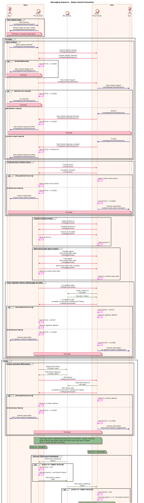

.. dst-doc documentation master file, created by
   sphinx-quickstart on Thu May 17 17:20:50 2018.
   You can adapt this file completely to your liking, but it should at least
   contain the root `toctree` directive.

Developer Reference
====================

Sequence diagrams
------------------
Messaging sequence of simple transaction
````````````````````````````````````````
This sequence diagram explains how a simple transaction is made between the two nodes.
And also explains when the node is communication with blockchain network to execute the functions of contracts.


