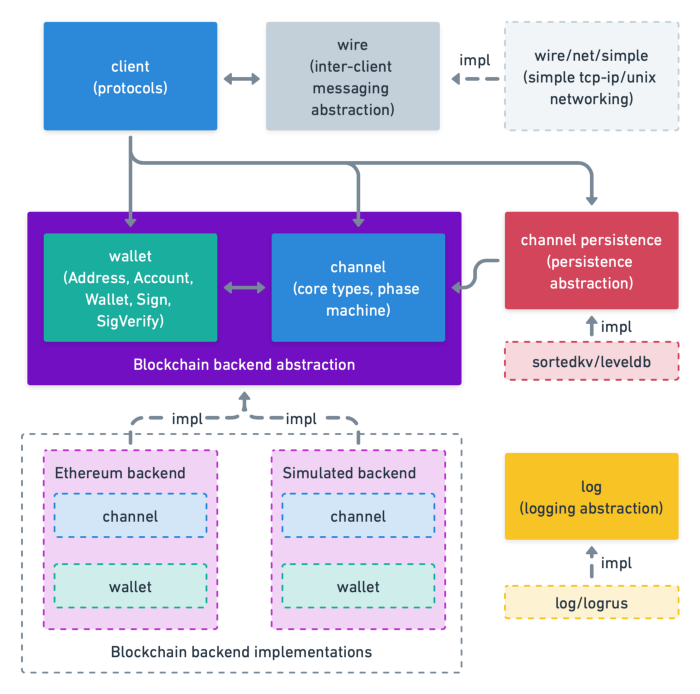

Go-Perun
========

`Go-Perun <https://github.com/hyperledger-labs/go-perun>`_ is an open-source library for building state channel applications on top of almost any transaction backend.
It is designed with modularity in mind.

Project info
------------

**Disclaimer.**
This software is still under development.
The authors take no responsibility for any loss of digital assets or other damage caused by the use of it.

**Funding.**
The project is supported by the German Federal Ministry of Education and Research (BMBF) through the StartUpSecure grants program as well as the German Science Foundation (DFG), the Foundation for Polish Science (FNP), and the Ethereum Foundation.

**Contact.**
Feel free to provide your feedback on the library via `our GitHub page <https://github.com/hyperledger-labs/go-perun>`_. For business inquiries you can contact us at `info@perun.network <mailto:info@perun.network>`_. More information can be found at `<https://perun.network/>`_.

Architecture
------------

**Abstract interfaces.** At the core of the library is the client package which represents the fundamental protocols. A client interacts with its environment through abstract interfaces.

* The transaction backend is represented by package wallet, which represents account logic and package channel, which provides the core data structures of a channel.
* The peer-to-peer communication layer is represented by package wire.
* Data persistence is provided through package channel/persistence.
* Logging is provided through the package log.

**Instantiation depending on the application context.** When building an application, the abstract interfaces are instantiated with concrete implementations depending on the application context.
By default, the library ships with an Ethereum adapter as the transaction backend, a TCP/IP adapter for client communication, a LevelDB adapter for data persistence, and a Logrus adapter for logging.

Developer Tutorial
------------------

In this tutorial, you will learn how to build a simple payment channel application on top of Ethereum using `go-perun <https://github.com/perun-network/go-perun>`_.

Prerequisites:
    - Basic knowledge of Golang
    - Basic knowledge of Ethereum

The source code is available at `GitHub <https://github.com/perun-network/perun-examples/tree/master/simple-client>`_.

| **Our final setup:**
| *Alice* and *Bob* are our two clients who want to enjoy the power of Perun's payment channels.
  They have an on-chain connection to an Ethereum blockchain for depositing & withdrawing funds onto their payment channel.
  Also, they have a direct connection to each other for operating their payment channel.
  All payments within this channel happen without touching the blockchain; they are executed ✨off-chain✨!

👉 :ref:`Getting Started <Getting Started>`

.. toctree::
   :hidden:

   tutorial/getting-started
   tutorial/setup/index
   tutorial/channels/index
   tutorial/together
