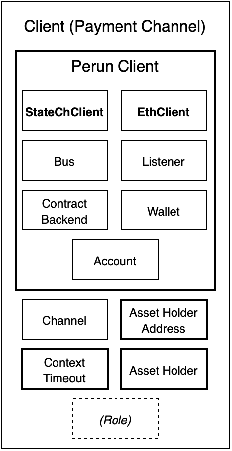

.. _client-index:

Clients
=======

We will need one Client per participant.
The Client object includes multiple tools that fully implement the participant's functionalities required to interact with state channels.
Much of the following implementation can be re-used in other contexts.
Only a few details is specific to our example.

Pictured above is the structure of our client implementation.
We will explain everything from the in to the outside.

We structure the Client description into three parts:
First we will take a look at the in-code channel representation where we will define our payment functionality.
Then we define the actual Client object and add the channel opening procedure.
Finally we introduce a Handler to the Client that will automatically take care of on-chain events.

The code you see in the following will run in the `client` package.

.. code-block:: go

    package client

.. toctree::
   :hidden:

   perunclient
   client
