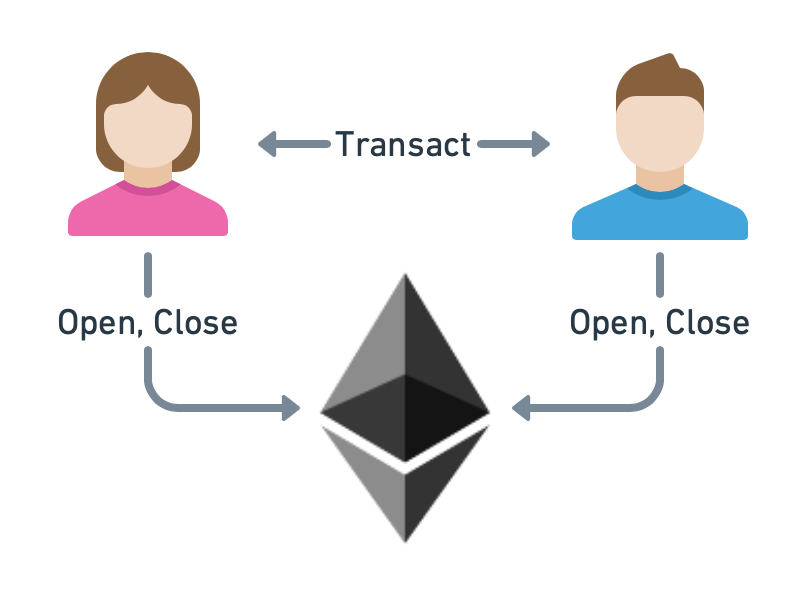

.. _payment_tutorial_intro:

Introduction
=======================

In this tutorial, we want to take a look at the process of creating a simple application that allows two clients, Alice and Bob, to open a *go-perun* channel and use it for performing off-chain payment transactions.
We use Ethereum as the blockchain backend for funding channels and resolving disputes.

We will introduce the functionality that *go-perun* offers for this simple use case.
The presented implementation can be used as an example that helps you build your own channel application.

.. _payment_tutorial_deps:

Dependencies
-------------
Before we start, let us cover the dependencies required for following this tutorial.

Tutorial Source Code
~~~~~~~~~~~~~~~~~~~~

The source code is available at `perun-examples/payment-channel <https://github.com/perun-network/perun-examples/tree/master/payment-channel>`_.

.. code-block:: bash

   # Download repository.
   git clone https://github.com/perun-network/perun-examples.git
   cd perun-examples/payment-channel

.. attention::

    We use ``context.TODO()`` and ``panic(err)`` throughout the tutorial to keep the code simple. In production code, one should always initialize the context and handle errors properly.

Go
~~~

The tutorial source code will be written in `Go <https://golang.org>`_.
Basic knowledge of *Go* is therefore required.
The `official installation guide <https://golang.org/doc/install>`_ describes how to install the required command-line tools.

.. code-block:: bash

   # Check that Go is installed.
   go version

Ganache
~~~~~~~

We will use `ganache-cli <https://github.com/trufflesuite/ganache>`_ as a local Ethereum blockchain for testing.
Please make sure that it is installed. You can find installation instructions on their `web page <https://github.com/trufflesuite/ganache>`_.

.. code-block:: bash

   # Check that ganache-cli is installed.
   ganache-cli --version
