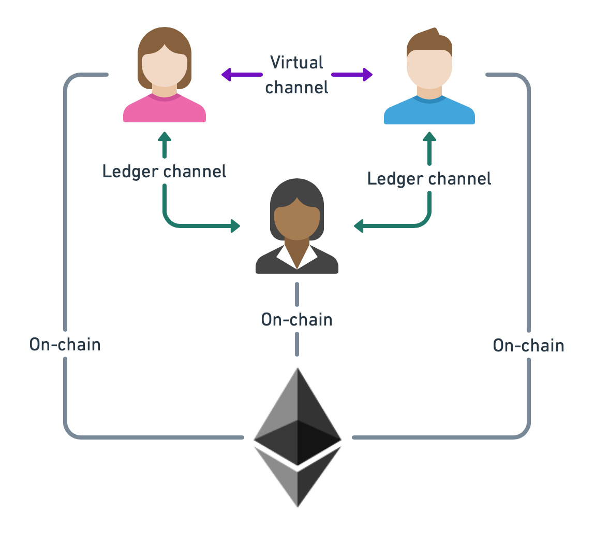

.. _virtual_channel_tutorial_intro:

Virtual Channel Tutorial
------------------------

In this tutorial, we will explain how Go-Perun can be used to create a two-party virtual payment channel.
A virtual channel is a channel that is funded off-chain from existing channels.
In our scenario, we will have the parties Alice, Bob, and Ingrid.
Alice and Bob have an open ledger channel with Ingrid and will then open a virtual channel between each other.

Protocol
========

The virtual channel protocol is described in section :ref:`concepts-protocols`.
Transactions in a virtual channel work the same as in other types of channels.
What is different is the funding and settlement.
Funds will be deducted from the open channels with Ingrid, and then provided to the newly created virtual channel between Alice and Bob. Once the channel is created, they can make peer-to-peer payments between each other without involving Ingrid. However, Ingrid is involved in the creation and settlement of the virtual channel.

Source code
===========

As an example we will rely on the `virtual channel test <https://github.com/hyperledger-labs/go-perun/blob/v0.9.1/client/virtual_channel_test.go>`_ of Go-Perun. This test shows how a virtual channel is created and used.

Channel opening
+++++++++++++++

As a pre-requisite, we require that Alice and Bob have an open channel with Ingrid. These channels are created at the beginning of the test setup.

Once Alice and Bob have an open channel with Ingrid, Alice specifies the virtual channel proposal that she will send to Bob.

.. literalinclude:: ../source/go-perun/client/test/virtualchannel.go
    :language: go
    :lines: 285-300

Virtual channel proposals are created using ``client.NewVirtualChannelProposal`` and then specifying the identifiers of the channels from which the funds come from.

.. literalinclude:: ../source/go-perun/client/test/virtualchannel.go
    :language: go
    :lines: 297

Furthermore, it must be specified how the indices of the participants map from the parent channels to the virtual channel. Here, we specify that Alice has index in the virtual channel and Bob has index 1.
Ingrid, on the other hand funds the respective opposite party and therefore takes their index during the funding and settlement phase.

.. literalinclude:: ../source/go-perun/client/test/virtualchannel.go
    :language: go
    :lines: 290-291

The channel proposal is sent as usual by using ``client.ProposeChannel``.

.. literalinclude:: ../source/go-perun/client/test/virtualchannel.go
    :language: go
    :lines: 302

Afterwards, a channel object is returned that can be used for off-chain transactions just as any other channel object.

Channel closing
+++++++++++++++

The virtual channel settlement protocol guarantees that either the funds are withdrawn back into the parent ledger channels, in the optimistic case, or, in the dispute case, that the funds are withdrawn on the ledger.
Perun handles both cases for you. As a user of the library, you simply need to call ``ch.Settle`` as usual.
