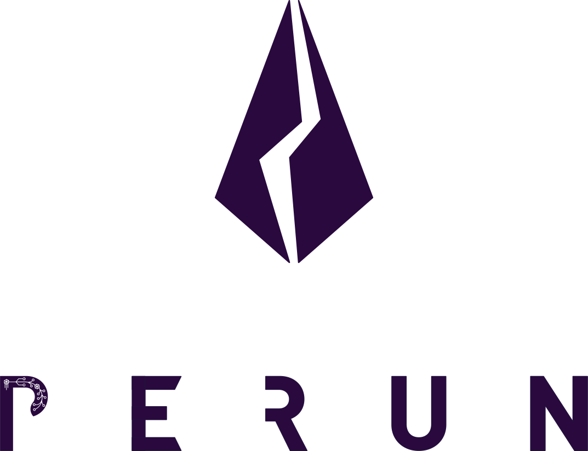

.. SPDX-FileCopyrightText: 2020 Hyperledger
   SPDX-License-Identifier: CC-BY-4.0

|

The Perun Framework
===================

The Perun Framework is a modular framework for building blockchain-agnostic payment and state channel applications.
It is an implementation of the `Perun protocols <https://perun.network/pdf/Perun2.0.pdf>`_ and provides payment and general state channel functionality for blockchain as well as classical transaction backends.
As a scalability solution, payment and state channels reduce transaction cost and latency by executing transactions directly from peer to peer.
The Perun protocols are proven cryptographically secure and the framework is designed with interoperability in mind.

Table of contents
-----------------
.. toctree::

   introduction
   concepts/state-channel
   node/introduction
   
