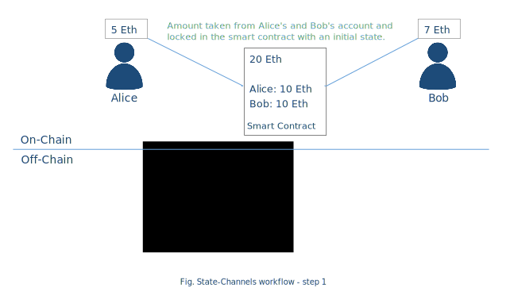
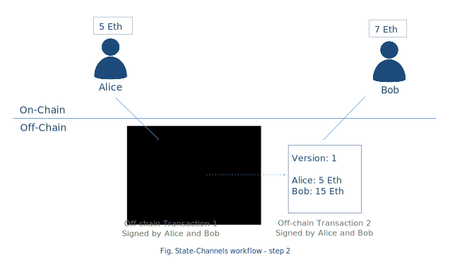
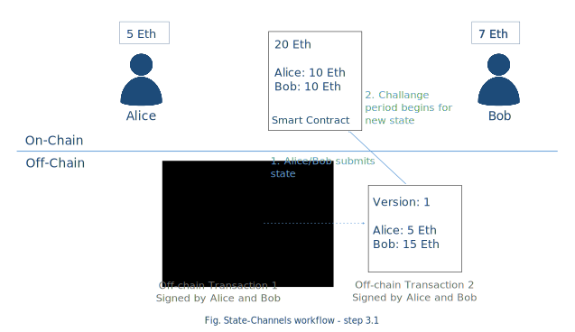
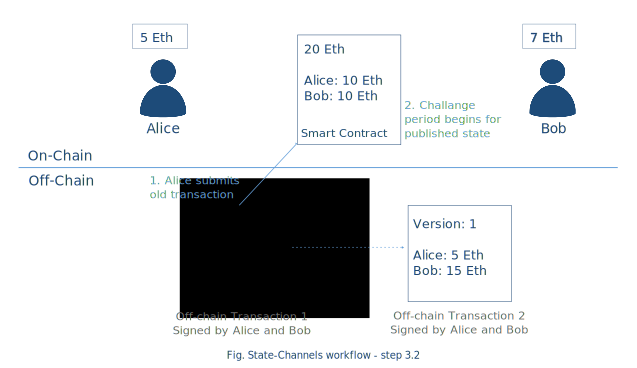
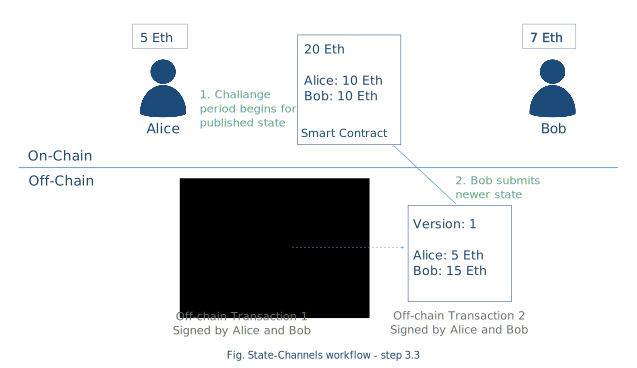
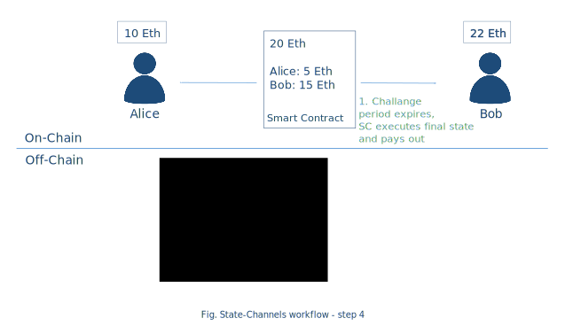
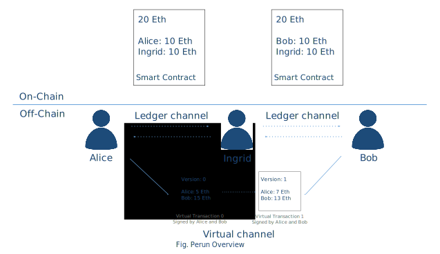

.. dst-doc documentation master file, created by
   sphinx-quickstart on Thu May 17 17:20:50 2018.
   You can adapt this file completely to your liking, but it should at least
   contain the root `toctree` directive.

Introduction
=============

What is the "Direct State Transfer" project about?
--------------------------------------------------

Direct State Transfer (DST) is an open source project which aims to provide a common interface for using state channels. 
It is a node-based implementation on top of existing distributed ledgers like Ethereum and communication protocols such as WebSockets.

Link to the project on GitHub: https://github.com/direct-state-transfer

2nd Layer Scaling
-----------------

A DLT (Distributed Ledger Technology, e.g. Blockchain) cannot simultaneously provide secure and trustworthy consensus – often achieved via complex and slow operations like Proof of Work (PoW) or Proof of Stake (PoS) algorithms – and high transaction volume and throughput. 

Here 2nd layer protocols come to the rescue: by reducing the number of transactions with the underlying DLT and letting most transactions happen “off-chain”, i.e. directly between peers via so-called state channels, transactions can be scaled both in volume and rate on the second layer while the first layer (DLT) serves as a notary or escrow service providing the necessary security guarantees:

.. image:: ./images/introduction/state_Channels_Overview.svg
  :align: Center
  :alt: Image not available

State Channels
``````````````

State channels provide an ad-hoc solution for time-constrained problems. As the cost of these transactions via state channels can be near-nil and transaction speed is only limited by the underlying peer-to-peer communications technology, they provide a suitable basis for performing micro-transactions repeatedly over a period of time. Scaling transactions for permanent or long-running problems could be better achieved via other technologies like sidechains.

A state channel protocol can be compared to a pre-paid account,
where initially some assets are blocked,
then the transactions over these assets are performed
and finally the resulting state is published and executed.

Therefore, the lifecycle of a state channel consists of four phases:

1. Open: Publish initial state (block assets)
2. Transact: Exchange states directly
3. Register: Publish final state
4. Close: Execute final state

These four phases are now described in more detail.

Phase 1: Open
^^^^^^^^^^^^^

Locking amount x (e.g. money or assets) from all involved parties, by using a smart contract on the DLT.
This will be the initial state for the further off-chain transactions.



Phase 2: Transact
^^^^^^^^^^^^^^^^^

In this phase, the parties will exchange transactions in a direct way.
These transactions will modify the initial state
and distribute the blocked assets among the participants.
The agreement to a new state must be approved by all involved parties
and is performed by signing the new state and send it to the other participants.
The order of the states is done by using a version counter.



Phase 3: Register
^^^^^^^^^^^^^^^^^

After transactions are done and a final state is achieved,
any of the parties can submit the final state to the smart contract.
The published state is validated by the smart contract
by checking if the signatures are corresponding to the included state.
Publishing a state triggers a defined challenge period.
During this time, the other participant of the channel can check
if the published state corresponds to its final state.




In general, there are three options to react:

1. Let the challenge period go to an end if the final state is the same as local. This will preserve transaction cost.
2. Publish the same state, this will be treated as an agreement and the smart contract will execute the final state immediately, before the timeout will reach his end.
3. If the published state does not corresponds to the local final state, this final state can be published. As its version is higher than the other one, this will be executed by the smart contract if the challenge period is still active.

The next picture will show the steps if one of the party tries to update the contract with an older state.



During the challenge period, the other party can submit the newer state if it has any.



Phase 4: Execute
^^^^^^^^^^^^^^^^

Once the challenge period expires, the final available state will be executed.
In case of blocked money/assets, it will be distributed to the corresponding accounts
based on the published final state the smart contract received.



Perun Protocol Overview
```````````````````````

Perun specifies a second layer state channel protocol to achieve off-chain transactions,
either for simple payments or generic smart contract off-chain execution.
The protocol specifies the unique feature of so called virtual channels
to minimize needed communication with a DLT for setup and closing.
These virtual channels are built on top of existing state channels,
so called ledger channels, which are constructed using smart contracts.



The official web page for the protocol specification is available under `perun.network <https://perun.network/>`_

The non-technical summary of the protocol can be found `here. <https://drive.google.com/file/d/1phBzFXt2QDEemh0JIOAI80nibe3JTRu5/view>`_

There is also a whitepaper existing regarding `Generic State Channel Networks <https://eprint.iacr.org/2018/320.pdf>`_. 
This contains the first full specification of generic state channel networks
that support an arbitrary number of intermediaries and allow users to run complex smart contract off-chain.

Overview of Perun Smart Contracts
---------------------------------
dst-go software (in current version), uses the following three smart contracts defined
by the Perun project to do off chain transactions.
The contracts are available in the legacy directory in the repository mentioned below.
Perun smart contracts on github : https://github.com/PerunEthereum/Perun

Basic Channel Contract (MSContract.sol)
```````````````````````````````````````
This is the contract to set up a basic state channel in which two parties agree (offline) on an internal contract (e.g., a virtual payment channel VPC) and execute this contract offline.

Virtual Payment Channel (VPC.sol)
`````````````````````````````````
The virtual payment channel is a contract, which distributes funds between two users depending on states, which are signed by them. This contract can be run in the basic channel since the VPC can be executed even without the interaction of both users. It is sufficient to have a signed message from them. This allows execution even if one party aborts.

Signature Library (LibSignature.sol)
````````````````````````````````````
This library allows efficient verification of ECDSA signatures. Both MSContract and VPC use this library internally.

Releases
--------

Current version of dst-go implements basic ledger channel and the complete walkthrough using the Perun smart contracts (legacy version).
