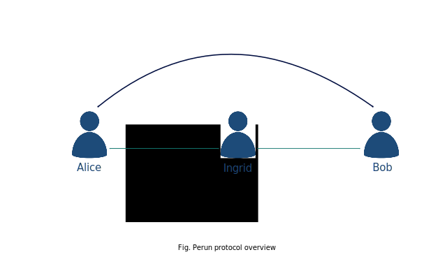
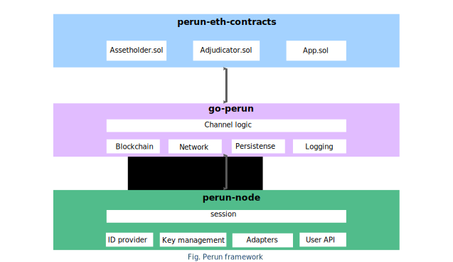

.. SPDX-FileCopyrightText: 2020 Hyperledger
   SPDX-License-Identifier: CC-BY-4.0

Introduction
============

Perun is an open source project that aims to increase blockchain transaction
throughput by using just a handful of main chain transactions to move an entire
peer-to-peer network of activity off the main chain. After an initial setup of
a set of basic transaction channels, this network lets any participant transact
with any other participant via virtual channels which do not require additional
on-chain setup. 

Started as an independent open-source project, as a collaboration between the
`Robert Bosch GmbH's "Economy of Things" project
<https://www.bosch.com/research/blog/economy-of-things/>`_ and the `Perun
team <https://perun.network/>`_ of Technical University of Darmstadt (TUDa),
we later joined the Hyperledger Foundation as a Hyperledger Labs project. The
main objective of the project is to make the blockchain ready for mass
adoption and alleviate current technical challenges such as high fees,
latency and low transaction throughput.

Link to the project on GitHub: https://github.com/hyperledger-labs?q=perun

Perun Protocol
--------------

The project is based on a on the perun protocol, a set of cryptographic
protocols invented and formally analyzed by cryptographic researchers at TUDa
and the University of Warsaw. Perun protocol allows users to shift
transaction and smart contract execution away from the blockchain into
so-called payment and state-channels. These channels are created by locking
coins on the blockchain and can be updated directly between the users and
without any on-chain interaction. This makes state-channel-based transactions
much faster and cheaper than on-chain transactions. The underlying blockchain
guarantees that all off-chain transactions will be enforced on-chain
eventually. For a detailed explanation on the concept of state channels,
please read section on :ref:`State Channels`.

In comparison to other channel technologies like the Lightning Network, the
Perun construction offers the following unique features:


State-channel virtualization
````````````````````````````````````
To connect users that do not have a joint open state-channel, existing
state-channels can be composed to form so-called virtual channels. These
virtual channels are created and closed off-chain over the state-channel
network intermediaries. Once opened, the virtual channel is updated directly
off-chain between the two connected end users. State-channel virtualization is
a concept which is yet to be implemented.



Blockchain-agnostic
```````````````````
Its modular design enables the flexible integration of Perun’s state-channel
technology into any Blockchain or traditional ledger system. 

Interoperability
````````````````
The blockchain agnostic design and state-channel virtualization enable
transaction and smart contract execution even across different blockchains
(cross-chain functionality). The components such as logging, messaging and
persistence are designed in a way that all the features can be customized for
some particular use cases.


High security
`````````````
The Perun protocol specifications have been mathematically proven using the
latest methods of security research.

The Perun protocol can be used for a wide range of applications in different
areas such as finance/FinTech, mobility, energy, e-commerce, telecommunication
and any other use case where direct microtransactions are needed.

You can find `Perun <https://ieeexplore.ieee.org/document/8835315>`_ `publications <https://dl.acm.org/doi/10.1145/3243734.3243856>`_ `here <https://www.springerprofessional.de/en/multi-party-virtual-state-channels/16720256>`_.

Framework Components
--------------------------

In the Hyperledger Lab "Perun", we are developing a set of software
components, which together constitute the Perun Framework. The below diagram
shows the software components and the functionalities offered by them.
Following the diagram is a brief explanation on each of the components.



perun-eth-contracts
```````````````````
This provides the Ethereum smart contracts required for implementing the Perun
protocol.

Link to the project on GitHub: https://github.com/hyperledger-labs/perun-eth-contracts

go-perun
`````````
An SDK that implements core components of the Perun protocol (state-channel
proposal protocol, the state machine that supports persistence and a watcher)
and an Ethereum blockchain connector. It is designed to be blockchain agnostic.

Link to the project on GitHub: https://github.com/hyperledger-labs/go-perun

perun-node
``````````
A multi-user node that uses the go-perun SDK to run the Perun protocol and
provides an interface for users to manage their keys/identities; off-chain
networking; open, transact and settle state-channels.

For detailed information on perun-node, read the :ref:`node-intro` on
perun-node section.

Link to the project on GitHub: https://github.com/hyperledger-labs/perun-node

Currently, the following have been realized:

1. go-perun SDK that implements fully generalized state channels on ethereum
   with support for persistence.

2. perun-node that implements two party payment channels, a local file based
   ID provider and a gRPC interface for user interaction.

3. perun-nodecli that serves as a reference client implementation for using the
   gRPC API of the perun-node. Its offers an interactive command-line interface
   with full support for auto-completion.

On the Roadmap, we plan to add the following features:

1. Virtual channels 

2. SSI integration with Hyperledger Aries

3. Additional blockchain backends

4. Cross-chain channels
