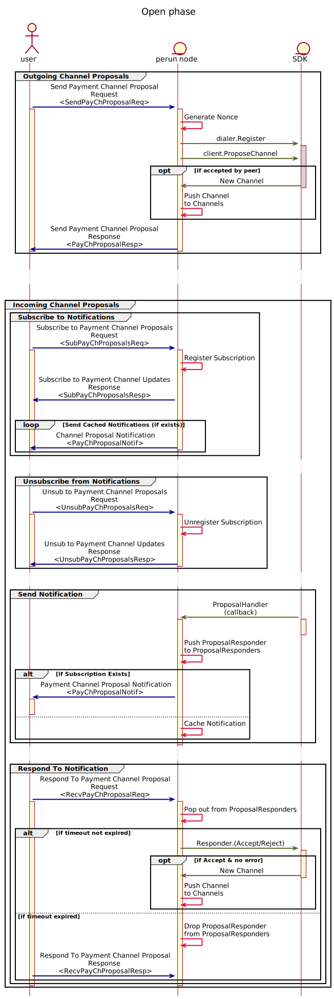
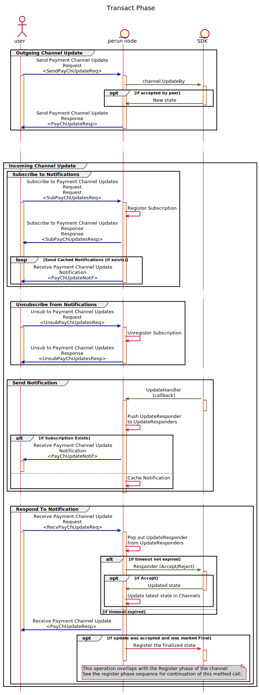
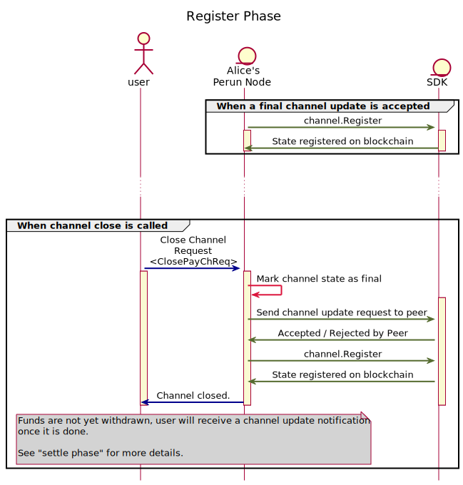
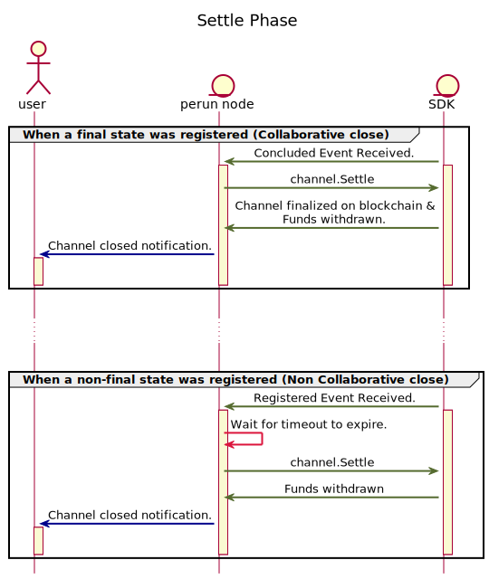

.. SPDX-FileCopyrightText: 2021 Hyperledger
   SPDX-License-Identifier: CC-BY-4.0

Interaction among user, perun node and SDK
==========================================

In this section, we present sequence diagrams that describe the interaction
among user, perun-node and go-perun SDK for opening a session and across the
four phases of the state channel: Open, Transact, Register and Close.

Opening a session
-----------------

In this section, the user opens a session with the perun node, providing the
configuration to initialize key handlers, off-chain communication adapters, ID
providers and the persistence adapter.

It is optional for the user to provide the configuration for blockchain
adapter. If not provided, the default adapter of the node will be used.

.. image:: ../../_generated/node/seq_0_open_session.svg
  :align: Center
  :alt: Image not available

.. note::
  Channels is data field that tracks all the channels in a session.

Once a session is opened, user can open, use and close payment channels. If the
any channels are restored from persistence, then the user can directly transact
on them if they are still in the transact phase or close them if they have
already been registered and challenge duration had expired.

Open Phase
----------

In this phase, a user can either propose a channel or respond to an incoming
channel proposal from another user by either accepting or rejecting it.

.. note::
  ProposalResponders is a data field to track all the Responder objects for
  incoming proposals, as the responder is used only when the user sends a
  Respond request.

.. note::
  Incoming proposal notification are cached if there is no active subscription.

  Entries from the notification cache are removed only when they have been
  delivered to a valid subsctiption or when the session is closed.
  
Once both the parties agree on the initial state of the channel and fund the
channel on the blockchain, it progress to the transact phase.

Transact Phase
--------------

In this phase, a user can either propose a new state update or respond to an
incoming state update by either accepting or rejecting it.

.. note::
  UpdateResponders is a data field to track all the Responder objects for
  incoming channel updates, as the responder is used only when the user sends a
  Respond request.

.. note::
  Incoming update notification are cached if there is no active subscription.

  Entries from the notification cache are removed only when they have been
  delivered to a valid subsctiption or when the session or channel is closed.
  

The channel participants can send as many channel updates as they desire. When
any one of the channel participants want to close the channel, they send a
channel close request to the perun-node and the channel progresses to the
register phase.

.. note::
  Collaborative and Non Collaborative Close:

  When a close request is sent by any of the channel participants, perun-node
  will mark the latest state of the channel as final and send an update request
  to the peer.  Like any other channel update, this can be accepted / rejected
  as described in "Transact phase". If it is

  - accepted by the peer -> Collaborative close will follow. 
  - rejected by the peer -> Non Collaborative close will follow.

  In both cases, the node will call `channel.Register` in the next phase. The
  difference is that,

  1. In case of collaborative close, the channel state will be directly
     concluded on the blockchain, without needing to register and wait for the
     challenge duration to expire.

  2. In case of non-collaborative close, the channel state will first have to
     be registered on the blockchain. Both the participants have to then wait
     for the challenge duration to pass and then conclude it. The challenge
     duration allows time for the other pariticipant to refuse if an older
     state was registered.
     
  Collaborative Close is an optimization to close the channel with lesser
  transactions on the blockchain (one instead of two) and with no waiting
  period.

Register Phase
--------------

In this phase, either a non-final state is registered or a final state is
directly concluded on the blockchain. This depends on if the pariticipant have
chosen non-collaborative or collaborative close respectively.

If a non-final state was registered on the blockchain and other participant
sees that it is not the latest state, it can refute to the registered state by
registering the latest state to the blockchain. This can go on until the no
participants refute until challenge duration expires. Once it expires, the
channel progresses the settle phase.

If a final state was directly concluded on the blockchain, then also the
channel progresses to the settle phase.

Settle Phase
------------

In this phase, the node concludes the state of the channel on the blockchain
(only in case of non-collaborative close) and withdraws the funds back to the
user's account.

Once a channel is settled, user receives a channel close notification. Now the
amount held by user in the concluded state of the channel will have been
withdrawn to the user's on-chain account.
