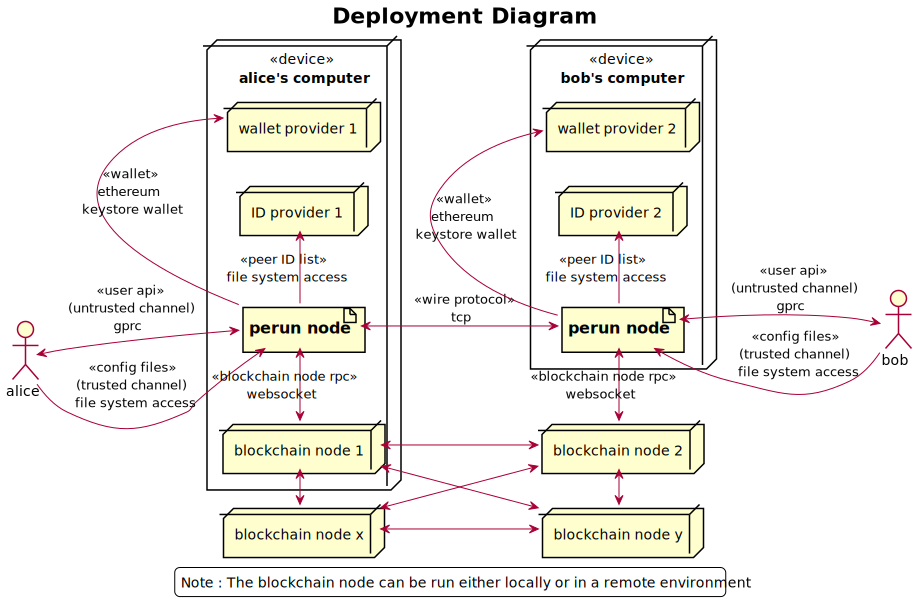

.. SPDX-FileCopyrightText: 2020 Hyperledger
   SPDX-License-Identifier: CC-BY-4.0

##########
Perun-node
##########

.. _node-intro:

Introduction
============

Perun-node is a multi-user node software intended to provide users to open,
transact on and settle state channels. It is implemented in golang and
currently supports payment channels on ethereum. Running an instance of
perun-node will start also start an API server, that serves APIs for the user
to interact with the node.

It uses the go-perun SDK for running the perun protocol and implements the
following functionalities on top of that.

Functionalities
---------------

Off-Chain Identity Management
^^^^^^^^^^^^^^^^^^^^^^^^^^^^^

Enable the user to identify participants in the off-chain network by using an
Identity provider service. Currently, we have implemented a local identity
provider by storing a list of known participants and their identities in a file
on the disk. The user can aliases to reference the identities of off-chain
participants.

Key Management
^^^^^^^^^^^^^^

Enable the user to manage his cryptographic keys used for signing on-chain
transactions and off-chain messages. Currently we have implemented support for
ethereum keystore.

Session
^^^^^^^

Provide an environment for the user access his ID provider, key manager and
manage all the channels, throughout their lifecycle. In the context of a
session, he/she can open a state channel, do some transactions through channels
and settle the channel. Each session runs its own instance of state channel
network client, ID provider, key manager; and hence provides a complete
isolated environment within the node. It is this feature that enables multiple
users to use the same node by having dedicated sessions for each of them.

User need not be worried about losing his/her data when a sudden closure of
session occurs due to some network error or because of some other reasons.  All
the data within the sessions are continuously persisted. User can reopen the
session at any time. User can close the session according to his/her needs. 

User API
^^^^^^^^

Provide an interface for the user to interact with the node. The UserAPI
consists of three category of methods: Node, Session and Channel to access the
respective functionalities. Currently, we implement two party payment channel
API for ethereum blockchain using gRPC protocol. It can be used for opening a
payment channel where they can send or receive payments and finalize and settle
the channel on the blockchain.

Starting the perun-node will a run a grpc server and client for communication.
Each API used in the system and it's specifications is available at the below
link.

Link to API specification: https://github.com/hyperledger-labs/perun-proposals/blob/master/design/001-RPC-Interface-Specification.md

Perun-node cli
==============

Perun-nodecli is a single user software with an interactive CLI interface to
connect with and use a running instance of perun-node. It is an independent
module that uses gRPC client stubs generated from the API specification to
interact with perun-node and does not share any code with other components of
the project. It provides different set of commands such as `chain`, `node`,
`session`, `peer-id`, `channel` and `payment`. See the :ref:`User Guide` for
information on how to use these commands.

For steps to build the perun-node and tryout perun-node cli, see the next page.

Releases
========

Current version is
`v0.5.0 <https://github.com/hyperledger-labs/perun-node/releases/tag/v0.5.0>`_.

We have made 5 development releases so far. Of these `v0.1.0
<https://github.com/hyperledger-labs/perun-node/releases/tag/v0.1.0>`_ &
`v0.2.0
<https://github.com/hyperledger-labs/perun-node/releases/tag/v0.2.0>`_ are
legacy versions, developed under the project name 'dst-go', source code of
which can be found in `legacy/master
<https://github.com/hyperledger-labs/perun-node/tree/legacy/master>`_ of
perun-node repo.

Details on the new features and improvements included in each release can be
found in the `releases
section <https://github.com/hyperledger-labs/perun-node/releases>`_ of
perun-node repository.

User guide
===========

Deployment environment
----------------------

The below diagram shows the environment in which perun-node will be deployed.

In a test environment, the artifacts for setting up a contacts provider and
wallet provider can be generated using the perun-node software itself. But it
is upto the user to set up a blockchain node. Recommended way for trying out is
to use a ganache-cli node.

Pre-requisites
--------------

To use the perun-node, the following pre-requisites need to be met.

1. Linux operating system

2. Go (v1.14 or later)

3. (a) A running instance of ganache-cli (v6.9.1 or later) or
   (b) A local blockchain network started using geth node or
   (c) A connection to the ropsten testnet.

Note: If using ropsten testnet, user should have keys corresponding to accounts
funded on the testnet and needs to follow additional steps when generating
configuration artifacts.

Getting started
---------------

1. Start a blockchain network using ganache-cli node using the below command,
   The two accounts in the command correspond to accounts that will be used in
   default configuration artifacts that will be generated in a later steps.
   Both these accounts are funded with 10 ETH each.

.. code-block::

   ganache-cli -b 1 --account="0x1fedd636dbc7e8d41a0622a2040b86fea8842cef9d4aa4c582aad00465b7acff,100000000000000000000" --account="0xb0309c60b4622d3071fad3e16c2ce4d0b1e7758316c187754f4dd0cfb44ceb33,100000000000000000000"

2. Open a terminal, go to the location where the perun-node project should get
   reside, clone the project repository and switch into directory using the
   below command.

.. code-block::

   git clone https://github.com/hyperledger-labs/perun-node.git && cd perun-node

3. Run the tests using the below command.

.. code-block::

   go tests -tags=integration -count=1 -p 1 ./...

4. Build the project using the below command. This will generate two binaries:
   `perunnode` and `perunnode-cli`.

.. code-block::

   cd perun-node && make

Initializing the perun-node
---------------------------

To start a perun-node, user needs an ID provider, wallet provider, blockchain
node and a configuration file as show in the below diagram. The order in which
the artifacts have to be set up is show in the below diagram.

.. image:: ../_generated/node/act_node_init.svg
  :align: Center
  :alt: Image not available

1. The blockchain node was setup in step 4 of the :ref:`Getting started`. Run the
below command to generate the remaining artifacts.

.. code-block::

   ./perunnode generate

This will generate the following artifacts:

- Node: node.yaml file.
- Session: Two directories (alice and bob) each containing `session.yaml` file,
  `idprovider.yaml` file and `keystore` directory with keys corresponding to
  the on-chain and off-chain accounts.

When using ganache-cli node with command mentioned in :ref:`Getting started`,
these files can be used as such. The contracts addresses are pre-computed based
on the account address and will be deployed on the ganache-cli node in a later
step.

When using ropsten testnet, follow the steps mentioned in this
:ref:`(Optional) Connecting to ropsten testnet` section before proceeding
further.

2. Run the below command to start the perun-node. 

.. code-block::

   ./perunnode run

This will start the perunnode using the config file located at default path
`./node.yaml` that was generated in step 3. You will see a line "Serving
payment channel API via grpc at port :50001" with a blinking cursor.  Leave
this running in this terminal.

(Optional) Connecting to ropsten testnet
----------------------------------------

1. Start an instance of geth node or use an external service to connect with
   rospten testnet. In all case, update the URL (using websockets protocol) in
   the configuration files `node.yaml`, `alice/session.yaml` and
   `bob/session.yaml`.

2. The contracts for perun-node v0.5.0 are deployed on the testnet in the
   following addresses: adjudicator
   (0x7dd2c7d72aAADaE2467b429920d2df88798CCda4) and ETH asset holder
   (0x30241b890b0c1A2d9B6Ce3D172020647C94E2AFa). Updated these address in all
   three config files.

3. Create two accounts and fund them with a few ethers by requesting from
   faucet one for alice and one for bob. Update the keys and address of the
   created accounts in the session config files.

Initializing perunnode-cli
--------------------------

1. Open two new terminals side by side, one each for alice and bob roles
   respectively. In both the terminal, start the perunnode-cli app using below
   command:

.. code-block::

   ./perunnodecli

This will bring up an interactive shell with auto-completion support. Type
`help` to see a list of commands and their help message. Typing one of those
commands without any arguments will print the help message for that command,
including the list of sub-commands. All commands and sub-commands support
autocompletion.

2. Set the blockchain address. This address will be used by the sub-commands of
   chain command. Which are not a part of perun-node API, but are helper
   commands to directly interact with blockchain to deploy contracts and read
   on-chain balances.

.. code-block::

   chain set-blockchain-address ws://127.0.0.1:8545

3. (Optional step, required only when using ganache-cli node) In any one of the
   terminals, deploy perun contracts using the below commands. Just a reminder
   for one last time, you can almost get every value by using auto-completion
   (by pressing TAB) and get away without typing.

.. code-block::

   chain deploy-perun-contracts

4. Read the on-chain balance using the below commands. The addresses for
   default configuration are available as autocomplete suggestion, if some
   other address was used, it needs to be entered manually.

.. code-block::

   chain get-on-chain-balance 0x8450c0055cB180C7C37A25866132A740b812937B

   chain get-on-chain-balance 0xc4bA4815c82727554e4c12A07a139b74c6742322

You can use these commands at any time before opening, while open or after
closing a payment channel.

Opening a session, opening channel within it, making payments & closing it
---------------------------------------------------------------------------

From here on, choose one terminal for alice role and one for bob role. In each
step, the role will be the enclosed in square brackets before description.

1. Opening a session and reading peer ID.

   a. [Alice] Start the session and get the peer ID of bob to check if it is
   present. Getting the peer ID will also add the peer alias to auto-completion
   list. The alias will then suggested, wherever a peer alias is expected. Two
   exceptions where peer alias is not auto-completed are `peer-id add` and
   `peer-id get` commands, because these commands are designed to add/get peer
   IDs for unknown aliases.

   .. code-block::

      # [Alice]
      node connect :50001
      session open alice/session.yaml
      peer-id get bob

   b. [Bob] Repeat step 3 for bob using below commands:

   .. code-block::

      # [Bob]
      node connect :50001
      session open bob/session.yaml
      peer-id get alice

4. Sending a request to open a payment channel and accepting it.

   a. [Alice] Send a request to open a channel with bob:

   .. code-block::

      # [Alice]
      channel send-opening-request bob 1 2

   b. [Bob] Receives a channel opening request notification that includes
   request ID. Type the command to accept the channel opening request directly
   after receiving the notification:

   .. code-block::

      # [Bob]
      channel accept-opening-request request_1_alice

Once successfully accepted, information on the opened channel is printed in
both terminals.

5. Listing out open channels. In any of the terminals, type the below command
   to see the list of open channels:

.. code-block::

   channel list-open-channels

6. Sending a request to open a payment channel and rejecting it.

   a. [Bob] Send a request to open a channel with bob:

   .. code-block::

      # [Bob]
      channel send-opening-request alice 3 4

   b. [Alice] Receives a channel opening request notification that includes
   request ID. Reject it:

   .. code-block::

      # [Alice]
      channel reject-opening-request request_1_bob

   Once successfully accepted, information on the opened channel is printed in
   both terminals.

7. Sending a payment on the open channel and accepting it.

   a. [Alice] Send a payment to bob on an open channel:

   .. code-block::

      # [Alice]
      payment send-to-peer ch_1_bob 0.1

   b. [Bob] Receives a payment notification that includes the channel alias.
      Accept it:

   .. code-block::

      # [Bob]
      payment accept-payment-update-from-peer ch_1_alice

   Once payment is accepted, the updated information is printed on both
   terminals.

8. Sending a payment on the open channel and rejecting it.

   a. [Bob] Send a payment to bob on an open channel:

   .. code-block::

      # [Bob]
      payment send-to-peer ch_1_alice 0.2

   b. [Alice] Receives a payment notification that includes the channel alias.
      Reject it:

   .. code-block::

      # [Alice]
      payment reject-payment-update-from-peer ch_1_bob

   Once payment is rejected, green message is printed on alice terminal for
   successfully rejecting the payment. Red error message is printed on bob
   terminal as the payment was rejected by user.

9. Try to close the session will return error when there are open channels. Run
   the below command in any or both of the terminals and they should return an
   error.

.. code-block::

   session close no-force

10. Close the channel.

   a. [Alice] Close the channel with the below command.

   .. code-block::

      # [Alice]
      channel close-n-settle-on-chain ch_1_bob

   b. [Bob] Receives a finalizing update when alice sends close command. This
      is to finalize the channel off-chain, so that it can be collaboratively
      closed on the blockchain without waiting for challenge duration to expire.
      However, due to an issue (that will be fixed in next updated), the
      collaborative close will not work as expected. So reject the finalizing
      update:

   .. code-block::

      # [Bob]
      payment reject-payment-update-from-peer ch_1_alice

Now the program will opt for non-collaborative close by registering the state
on the blockchain, waiting for the challenge duration to expire and then
withdrawing the funds.

Even if Bob doesn't respond, Alice's request will wait until response timeout
expires (in this demo it is 10s) and then proceed with non-collaborative close.
Bob's node on the other hand will receive a notification when the channel is
finalized on the blockchain and funds will be withdrawn automatically. A
channel closed notification will be printed.

11. Close the session:

Since the open channels are closed, the session can be closed with the same
command as in step 8, but without any error.

.. code-block::

   # [Alice]
   session close no-force

   # [Bob]
   session close no-force

12. To try out persistence of channels:

   a. Open a session for alice, bob and then open a few channels using commands
      described in step 4.

   b. Close the session using force option:

   .. code-block::

      # [Alice]
      session close force

      # [Bob]
      session close force

   c. Open sessions for alice and bob again using the commands in step 3. Once
      the session is opened, the channels restored from persistence will be printed
      along with their aliases. You can send payments on these channels and close
      them as before. There is no difference between a channel opened in current
      session and a channel restored from persistence.

Remarks:

1. You can try to open as many channels as desired using the commands as
   described in step 4. Each channel is addressed by its alias (that will be
   suggested in auto-complete).

2. You can also try and send as many payments as desired using the commands as
   described in step 7. However, whenever a new payment notification is
   received, the previous one is automatically dropped. This however, is not a
   feature of payment channel API, where you can respond to any of the
   notifications as long as they have not expired. It was just a feature in the
   perunnode-cli app to make it simpler.

3. The purpose of the perunnode-cli software is to demo the payment channel API
   and also as a reference implementation for using the grpc client stubs.

