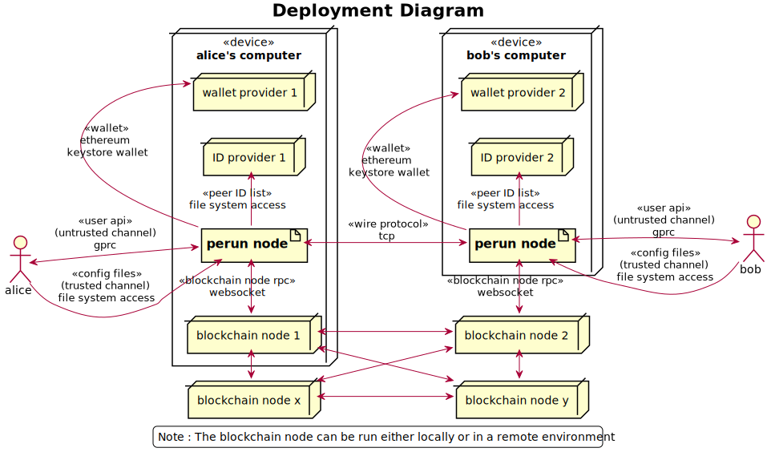
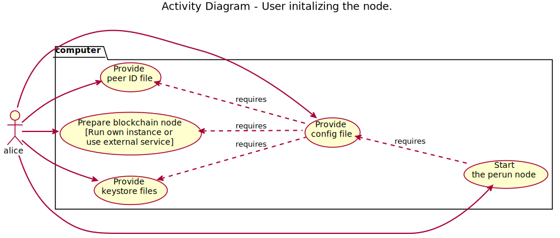

.. SPDX-FileCopyrightText: 2020 Hyperledger
   SPDX-License-Identifier: CC-BY-4.0

.. _User guide:

User guide
==========

Deployment environment
----------------------

The below diagram shows the environment in which perun-node will be deployed.

In a test environment, the artifacts for setting up a contacts provider and
wallet provider can be generated using the perun-node software itself. But it
is up to the user to set up a blockchain node. Recommended way for trying out
is to use a ganache-cli node.

Pre-requisites
--------------

To use the perun-node, the following pre-requisites need to be met.

1. Linux operating system

2. Go (v1.14 or later)

3. (a) A running instance of ganache-cli (v6.9.1 or later) or
   (b) A local blockchain network started using geth node or
   (c) A connection to the ropsten testnet.

.. note::
  If using ropsten testnet, user should have keys corresponding to accounts
  funded on the testnet and needs to follow additional steps when generating
  configuration artifacts.

.. note::
  For the code blocks that appear in the following sections, if they are
  prefixed by

  - **$**, execute them in terminal,
  - **>**, execute them in perun-node cli.

.. _Getting Started Perun Node:

Getting started
---------------

1. Start a blockchain network using ganache-cli node using the below command.
   The two accounts in the command correspond to accounts that will be used in
   default configuration artifacts which we will generate in later steps.
   We fund each of these accounts with 10 ETH each.

.. code-block::

  $ ganache-cli -b 1 --account="0x1fedd636dbc7e8d41a0622a2040b86fea8842cef9d4aa4c582aad00465b7acff,100000000000000000000" --account="0xb0309c60b4622d3071fad3e16c2ce4d0b1e7758316c187754f4dd0cfb44ceb33,100000000000000000000"

2. Open a terminal, clone the project repository and switch into the project
   directory.

.. code-block::

  $ git clone https://github.com/hyperledger-labs/perun-node.git
  $ cd perun-node

3. Run the tests.

.. code-block::

  $ go tests -tags=integration -count=1 -p 1 ./...

4. Build the project. This will generate two binaries: ``perunnode`` and
   ``perunnode-cli``.

.. code-block::

  $ cd perun-node && make

Initializing the perun-node
---------------------------

To start a perun-node, user needs an ID provider, wallet provider, blockchain
node and a configuration file. These artifacts and the order in which they have
to be set up is shown in the below diagram.

1. By now, we have setup a blockchain node and have generated the perun-node
   binary (by following steps 1 and 4 respectively in the
   :ref:`Getting Started Perun Node`). To generate the remaining artifacts, run
   the below command:

.. code-block::

  $ ./perunnode generate

This will generate the node and session artifacts:

- Node: node.yaml file.
- Session: Two directories (alice and bob) each containing ``session.yaml``
  file, ``idprovider.yaml`` file and ``keystore`` directory with keys
  corresponding to the on-chain and off-chain accounts.

When using ganache-cli node with command mentioned in
:ref:`Getting Started Perun Node`, these files can be used as such. The
contracts addresses are pre-computed based on the account address and will be
deployed on the ganache-cli node in a later step.

When using ropsten testnet, follow the steps mentioned in this
:ref:`(Optional) Connecting to ropsten testnet` section before proceeding
further.

2. Run the below command to start the perun-node.

.. code-block::

  $ ./perunnode run

This will start the perunnode using the config file located at default path
``./node.yaml`` that was generated in the previous step. If the perun-node was
started successfully, the node configuration will be printed as shown below
along with the text ``Serving...`` at the end. Leave the node running in this
terminal. If log file is set to empty string, logs will be printed in this
terminal.

.. code-block::

  $ ./perunnode run
  Using node config file - node.yaml
  Running perun node with the below config:
  {LogLevel:             "debug",
   LogFile:              "",
   ChainURL:             "ws://127.0.0.1:8545",
   Adjudicator:          "0x9daEdAcb21dce86Af8604Ba1A1D7F9BFE55ddd63",
   Asset:                "0x5992089d61cE79B6CF90506F70DD42B8E42FB21d",
   ChainConnTimeout:     10s,
   OnChainTxTimeout:     1m0s,
   ResponseTimeout:      10s,
   CommTypes:            ["tcp"],
   IDProviderTypes:      ["local"],
   CurrencyInterpreters: ["ETH"]}.

  Serving payment channel API via grpc at port :50001

.. _(Optional) Connecting to ropsten testnet:

(Optional) Connecting to ropsten testnet
----------------------------------------

1. Start an instance of geth node or use an external service to connect with
   rospten testnet. In all case, update the URL (use websockets protocol for
   connection and not http) in the configuration files ``node.yaml``,
   ``alice/session.yaml`` and ``bob/session.yaml``.

2. The contracts for perun-node v0.5.0 are deployed on the testnet in the
   following addresses: adjudicator
   (0x7dd2c7d72aAADaE2467b429920d2df88798CCda4) and ETH asset holder
   (0x30241b890b0c1A2d9B6Ce3D172020647C94E2AFa). Updated these addresses in all
   three config files.

3. Create two accounts, once each for alice and bob. Fund these accounts with a
   few ethers by requesting from faucet. Update the keys and address of the
   created accounts in the session config files.

Initializing perunnode-cli
--------------------------

1. Open two new terminals side by side, one each for alice and bob roles
   respectively. In each of the terminals, start the perunnode-cli app using
   below command to start an interactive shell.

.. code-block::

  $ ./perunnodecli

.. note::
  To see a complete list of commands, type ``help``. To see the list of
  sub-commands for each command, type the command without any arguemnts and
  hit enter.

  All commands and sub commands support autocompletion.

2. Set the blockchain address. This address will be used by the sub-commands of
   chain command.

.. code-block::

  > chain set-blockchain-address ws://127.0.0.1:8545

.. note::
  The chain command is not a part of perun-node API. It is a helper command in
  perun-node cli to directly interact with blockchain. We will be using it in
  the tutorial to read on-chain balances and deploy contracts.

3. (Optional step, required only when using ganache-cli node) Deploy perun
   contracts.

.. code-block::

  > # [In Alice's CLI]
  > chain deploy-perun-contracts

4. Read the on-chain balance. The addresses for
   default configuration are available as auto-complete suggestion, if some
   other address was used, it needs to be entered manually.

.. code-block::

  > # [In Alice's CLI]
  > chain get-on-chain-balance 0x8450c0055cB180C7C37A25866132A740b812937B

  > chain get-on-chain-balance 0xc4bA4815c82727554e4c12A07a139b74c6742322

You can use these commands at any time before opening, while open or after
closing a payment channel.

Open a session; open, use and close a payment channel
-----------------------------------------------------

From here on, choose one terminal for alice role and one for bob role. In each
step, a comment about the command will contain the role. If no role is
mentioned above a command, it can be typed into any of the terminals.

1. Open a session each for Alice and Bob. Also check if the other
   participant's peer IDs are registered.

.. code-block::

  > # [In Alice's CLI]
  > node connect :50001
  > session open alice/session.yaml
  > peer-id get bob

.. code-block::

  > # [In Bob's CLI]
  > node connect :50001
  > session open bob/session.yaml
  > peer-id get alice

.. note::
  Getting the peer ID will also add the peer alias to auto-completion list.
  When you press ``TAB`` after the sub-commands of ``channel``, ``payment``
  command that expect ``peer alias`` as the first argument, these aliases
  will be suggested.

2. Send a payment channel opening request and accept it.

a. Alice sends a payment channel opening request to Bob.

.. code-block::

  > # [In Alice's CLI]
  > channel send-opening-request bob 1 2

b. Bob receives a notification in his CLI. The incoming request contains a
   request ID.

.. code-block::

  > # [In Bob's CLI]
  > Channel opening request notification received. Notification Alias: request_1_alice.
  Currency: ETH, Balance: [alice:1.000000 self:1.000000].
  Expires in 10s.

.. note::
  Request ID is an identifier assigned by perun-node cli application to
  reference the request when accepting/rejecting it.

c. Bob accepts the request before it expires.

.. code-block::

  > # [In Bob's CLI]
  > channel accept-opening-request request_1_alice

d. Once Bob accepts the request, the channel will be funded on-chain. Once it
   is opened, both Alice and Bob receive notifications in their CLIs.

.. code-block::

  > # [In Alice's CLI]
  > Channel opened. Alias: ch_1_bob.
  ID: 94241c75d058186f40826be7ae0803f7731a423903c494faa05b347443bb0a4f, Currency: ETH, Version: 0, Balance [bob:1.000000 self:1.000000].

  Subscribed to payment notifications on channel ch_1_bob (ID: 94241c75d058186f40826be7ae0803f7731a423903c494faa05b347443bb0a4f)

.. code-block::

  > # [In Bob's CLI]
  > Channel opened. Alias: ch_1_alice.
  ID: 94241c75d058186f40826be7ae0803f7731a423903c494faa05b347443bb0a4f, Currency: ETH, Version: 0, Balance [alice:1.000000 self:1.000000]

  Subscribed to payment notifications on channel ch_1_bob (ID: 94241c75d058186f40826be7ae0803f7731a423903c494faa05b347443bb0a4f)

.. note::

  Channel alias is an identifier assigned by perun-node cli application to
  reference the channel when sending/receiving payments or closing it. It will
  be different for alice and bob, as it local to the perun-node cli instance.

  In this case, it is ``ch_1_bob`` for ``Alice`` and ``ch_1_alice`` for ``Bob``.

3. List all the open channels in a session along with their latest state.

.. code-block::

  > channel list-open-channels

3. Send a payment channel opening request and reject it.

Repeat sections (a) and (b) as in the step 2. This time, the request ID will be
different: ``request_alice_2``. Instead of accepting the request, reject it.

c. Bob rejects the request before it expires.

.. code-block::

  > # [In Bob's CLI]
  > channel reject-opening-request request_2_alice

d. After the channel is rejected, Bob will get the following response.

.. code-block::

  > Channel proposal rejected successfully.

e. And, Alice will get the following response.

.. code-block::

  > Error opening channel : The request was rejected by peer

4. Send a payment on the open channel and accept it.

a. Alice sends a payment to bob on the open channel (ch_1_bob).

.. code-block::

  > # [In Alice's CLI]
  > payment send-to-peer ch_1_bob 0.1

b. Bob receives a notification. Note that, the proposed version is different
   from the current version.

.. code-block::

  > # [In Bob's CLI]
  > Payment notification received on channel ch_1_alice. (ID:94241c75d058186f40826be7ae0803f7731a423903c494faa05b347443bb0a4f)
  Current:        Currency: ETH, Balance: [alice:1.000000 self:1.000000], Version: 0.
  Proposed:       Currency: ETH, Balance: [alice:0.900000 self:1.100000], Version: 1.
  Expires in 10s.

c. Bob accepts the payment.

.. code-block::

  > # [In Bob's CLI]
  > payment accept-payment-update-from-peer ch_1_alice

d. Once the payment is accepted, both Alice and Bob receive channel update
   notifications.

.. code-block::

  > # [In Alice's CLI]
  > Payment sent to peer on channel ch_1_bob. Updated channel Info:
  ID: 94241c75d058186f40826be7ae0803f7731a423903c494faa05b347443bb0a4f, Currency: ETH, Version: 1, Balance [bob:1.100000 self:0.900000].

.. code-block::

  > # [In Bob's CLI]
  > Payment channel updated. Alias: ch_1_alice. Updated Info:
  ID: 94241c75d058186f40826be7ae0803f7731a423903c494faa05b347443bb0a4f, Currency: ETH, Version: 1, Balance [alice:0.900000 self:1.100000]

5. Send a payment on the open channel and reject it.

Repeat sections (a) and (b) as in the above command. This time the current and
proposed versions will be different. Instead of accepting the channel, reject
it.

c. Bob rejects the payment from Alice.

.. code-block::

  > # [In Bob's CLI]
  > payment reject-payment-update-from-peer ch_1_bob

d. Once the payment is rejected, Bob will get the following response.

.. code-block::

  > # [In Bob's CLI]
  > Payment channel update rejected successfully.

e. And Alice will get the following response.

.. code-block::

  > # [In Alice's CLI]
  > Error sending payment to peer: The request was rejected by peer.

6. Error on closing a session with open channels without force option.

   Closing a session with open channels without ``force`` option should return
   an error. It is not safe to do so because, the node will not be able to
   refute if the other participant registers and finalizes an older state on
   the blockchain.

.. code-block::

  > session close no-force
  > Error closing session : Session cannot be closed (without force option) as there are open channels

7. Close the channel.

a. Alice sends a request to close the channel. Perun-node will send a channel
update to Bob, marking the latest state as final.

.. code-block::

  > # [In Alice's CLI]
  > channel close-n-settle-on-chain ch_1_bob

.. note::

  **Collaborative and Non collaborative channel close:**

  When any one of the channel participants sends a channel close request to the
  perun-node, an update is send to other participants marking the latest state
  of the channel as final.

  If this update is accepted by the peer, then this is called finalized
  state. A finalized state can be registered on the blockchain in a single
  transaction and the funds can be withdrawn immediately. This is called
  **Collaborative close**.

  If this update is rejected by the peer, then the latest state of channel is
  registered on the blockchain and both parties will have to wait for the
  challenge duration to pass. Once it passes, the state should be concluded
  on the blockchain and then the paricipants can withdraw their funds. This
  is called **Non collaborative close**.

b. Bob gets a finalizing channel update.

.. code-block::

  > # [In Bob's CLI]
  > Finalizing payment notification received on channel ch_1_alice. (ID:94241c75d058186f40826be7ae0803f7731a423903c494faa05b347443bb0a4f)
  Channel will closed if this payment update is responded to.
  Current:        Currency: ETH, Balance: [alice:0.900000 self:1.100000], Version: 1.
  Proposed:       Currency: ETH, Balance: [alice:0.900000 self:1.100000], Version: 2.
  Expires in 10s.

c. Bob accepts the notification, thereby enabling collaborative close.

.. code-block::

  > # [In Bob's CLI]
  > payment accept-payment-update-from-peer ch_1_alice

d. Once Bob accepts the update, he gets the following response. In the
   background, finalized state will be registered on the blockchain.

.. code-block::

  > # [In Bob's CLI]
  > Payment channel updated. Alias: ch_1_alice. Updated Info:
  ID: 94241c75d058186f40826be7ae0803f7731a423903c494faa05b347443bb0a4f, Currency: ETH, Version: 2, Balance [alice:0.900000 self:1.100000]

e. Once the finalized state is registered on the blockchain, funds will be
   withdrawn for both the participants. Both Alice and Bob will receive channel
   close notifications.

.. code-block::

  > # [In Alice's CLI]
  > Payment channel close notification received on channel ch_1_bob (ID: 94241c75d058186f40826be7ae0803f7731a423903c494faa05b347443bb0a4f)
  Currency: ETH, Balance: [bob:1.100000 self:0.900000], Version: 2.

.. code-block::

  > # [In Bob's CLI]
  > Payment channel close notification received on channel ch_1_alice (ID: 94241c75d058186f40826be7ae0803f7731a423903c494faa05b347443bb0a4f)
  Currency: ETH, Balance: [alice:0.900000 self:1.100000], Version: 2.

8. Close the session:

Since the open channels are closed, the session can be closed with the same
command as in step 6. This should return a success response as shown below.

.. code-block::

  > # [In Alice's CLI]
  > session close no-force

  > # [In Bob's CLI]
  > session close no-force

9. Try out persistence of channels:

a. Open a session each for alice and bob by following step 1. Then open a few
   channels by following step 2.  Now close the session for alice and bob with
   ``force`` option.

.. code-block::

  > # [In Alice's CLI]
  > session close force

  > # [In Bob's CLI]
  > session close force

b. Now, in the same or different instances of CLI, open the sessions for alice
   and bob specifying the same configuration file. The session will be opened,
   channels restored from persistence and their latest state along with the
   aliases will be printed. Now, you can send/receive payments on these
   channels and close them.

Remarks:

1. You can try to open as many channels as desired using the commands as
   described in step 2. Each channel is addressed by its alias (that will be
   suggested in auto-complete).

2. You can also try and send as many payments as desired using the commands as
   described in step 4. However, whenever a new payment notification is
   received, the previous one is automatically dropped. This however, is not a
   feature of payment channel API, where you can respond to any of the
   notifications as long as they have not expired. It was just a feature in the
   perunnode-cli app to make it simpler.

3. The purpose of the perunnode-cli software is to demo the payment channel API
   and also as a reference implementation for using the gRPC client stubs. In
   order to integrate the client for perun-node with your application, you can
   generate the gRPC client stubs in the desired language and directly use them
   in your application.
