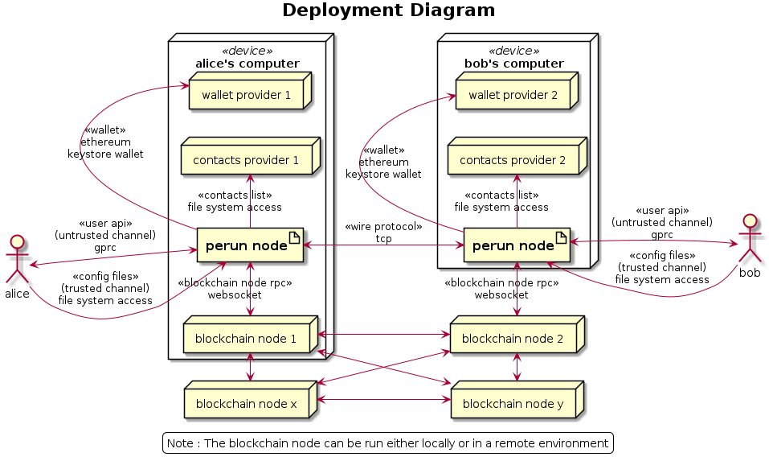
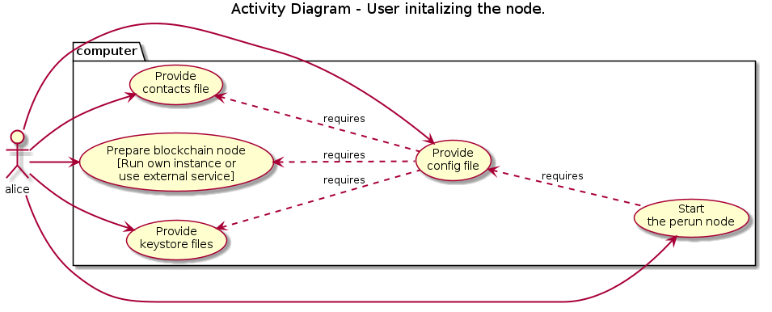
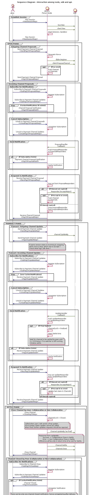

Perun Node Design
=================

This section documents the important aspects related to design of the perun node.

Deployment Diagram
------------------

The below diagram shows how the node will be deployed.

Use Case - Node Initialization
------------------------------

The below diagram shows how the user should initiaze a perun node.

Interaction among user, node and the SDK
----------------------------------------

The below diagram shows the interaction between user, node and the sdk.
Interactions between different components within the node (such as wallet management and
off-chain identity management) are not included in this diagram.

