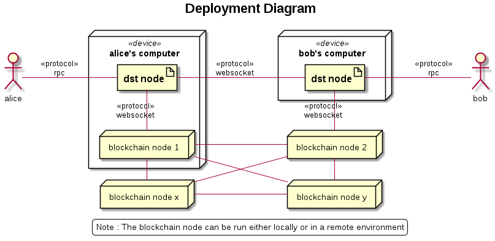

.. dst-doc documentation master file, created by
   sphinx-quickstart on Thu May 17 17:20:50 2018.
   You can adapt this file completely to your liking, but it should at least
   contain the root `toctree` directive.

Working with dst-go
===================

This document explains how to run tests and walkthroughs using dst-go software. The below diagram shows how the dst software will be deployed and the different entities with which it will interact.

The default configuration for ethereum address, node url, etc.,
is specified in the ``test_addresses.json`` file at ``dst-go/testdata``. The directory also contains keys for the default accounts and a sample ``known_ids.json`` file
that specifies the offchain addresses.

The default configuration is shown below.

.. code-block:: json

    {
        "ethereum_node_url": "ws://localhost:8546",
        "keystore_dir": "test-keystore",
        "known_ids_file": "known_ids.json",
        "alice_password": "",
        "bob_password": "",
        "alice_id": {
            "on_chain_id": "0x932a74da117eb9288ea759487360cd700e7777e1",
            "listener_ip_addr": "localhost:9601",
            "listener_endpoint": "/"
        },
        "bob_id": {
            "on_chain_id": "0x815430d6ea7275317d09199a5a5675f017e011ef",
            "listener_ip_addr": "localhost:9602",
            "listener_endpoint": "/"
        }
    }

You can either use this config file or provide your own testdata directory using the ``--configFile`` (as shown below) when running tests or walkthrough.

.. code-block:: bash

    ./walkthrough --simulated_backend --configFile="<full or relative path of config file>"

    #Run the command from the root directory of any module
    go test -args -configFile "<full or relative path of config file>"

Configuring test accounts :
---------------------------

In order to run tests or walkthroughs involving ethereum node, the accounts should be registered on blockchain and keys should be accessible by dst-go software.

If your starting with a new ethereum node, you can use the keys available at ``testdata/test-keystore`` to create accounts on blockchain and add sufficient balance as well. 

To run walkthrough once, Alice should have atleast 12 Ethers and bob 2 Ethers. Allowing 10 Ethers to be transferred from Alice to Bob and 2 Ethers for fees.

Alternatively if you have an ethereum node already running with active accounts, copy the key files to testdata directory and update the addresses in test_addresses.json and known_id.json files.

The IP Address mentioned against each user in the known_ids files is the address at which node will be listening for incoming connections for offchain transactions for that user.

Configuring network :
---------------------

By default the ethereum node is expected to be listening at ``ws://localhost:8546`` (as shown in default configurations file). However, if you have the node running at different address, update in the config file or provide it flags as shown below.

.. code-block:: bash

    ./walkthrough --simulated_backend --ethereum_address="<ethereum-node-url>"

Since the subscription feature of ethereum node is used to receive events, use only WebSockets or IPC connection url.

Starting a geth node :
----------------------
If an ethereum node is not already running and you want to start from scratch, you can use the following steps.

1. Install the ethereum software either using your package manager or by compiling from source.
2. Create a new ``genesis.json`` file from where you would like to start the geth node and add the following lines to it.

.. code-block:: json

    {
        "config": {
            "chainId": 1991,
            "homesteadBlock": 0,
            "ByzantiumBlock": 0,
            "eip155Block": 0,
            "eip158Block": 0
            },
        "nonce": "0xdeadbeefdeadbeef",
        "timestamp": "0x0",
        "parentHash": "0x0000000000000000000000000000000000000000000000000000000000000000",
        "extraData": "0x00",
        "gasLimit": "0x8000000",
        "difficulty": "0x400",
        "mixhash": "0x0000000000000000000000000000000000000000000000000000000000000000",
        "alloc": {
            }
    }

4. Then from the same directory, run the following command in terminal to initialize the geth node.

.. code-block:: bash

    geth --datadir="dataDir" --identity "eth_node_0" -verbosity 5 --port 30301 --rpc --rpcaddr="127.0.0.1" --rpcport 8101 --rpcapi "admin,db,eth,debug,miner,net,shh,txpool,personal,web3" --ws --wsapi "admin,db,eth,debug,miner,net,shh,txpool,personal,web3" --wsaddr="127.0.0.1" --wsport 8546 --networkid 4711 init genesis.json console

Now the data directory is created and you have to add the key files from the dst-go repository (at ``dst-go/testdata/test-keystore/<key-files>``) to geth's keystore (``datadir/keystore/<key-files>``).

5. Start the geth node using the following command. The websockets listening address and port are provided in "-\\-wsaddr" and "-\\-wsport" flags respectively.

.. code-block:: bash

    geth --datadir="dataDir" --identity "eth_node_0" -verbosity 5 --port 30301 --rpc --rpcaddr="127.0.0.1" --rpcport 8101 --rpcapi "admin,db,eth,debug,miner,net,shh,txpool,personal,web3" --ws --wsapi "admin,db,eth,debug,miner,net,shh,txpool,personal,web3" --wsaddr="127.0.0.1" --wsport 8546 --networkid 4711 console

Now the Geth Javascript console will open. Set the coinbase and start the miner.

.. code-block:: bash

    #set an account as coinbase to start mining
    > eth.coinbase

    # Start miner
    > miner.start()

Wait for sometime for ethers to be mined and accumulated in coinbase (alice) account.
Now transfer some ethers from alice account to bob account.

.. code-block:: bash

    #Check the balance and transfer only when sufficient ethers are available.
    > eth.getBalance(eth.coinbase)

    #Unlock account. Password is nil, so hit enter when prompted.
    > personal.unlockAccount(personal.listAccounts[0])

    #Transfer ethers from alice to bob
    > eth.sendTransaction({from: eth.coinbase, to: personal.listAccounts[1], value: web3.toWei(50,"ether")})

Once the balance is transferred successfully, you are all set to go.

Perform new offchain transaction
--------------------------------
This version does not support this feature until RPC interface is implemented.

Using the RPC interface
-----------------------
RPC development and integration is currently under development.
